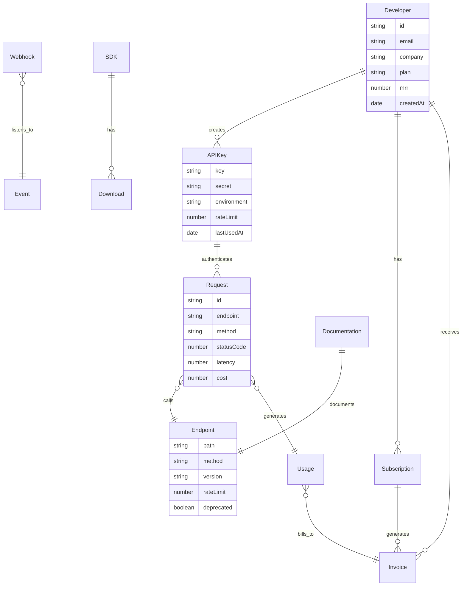
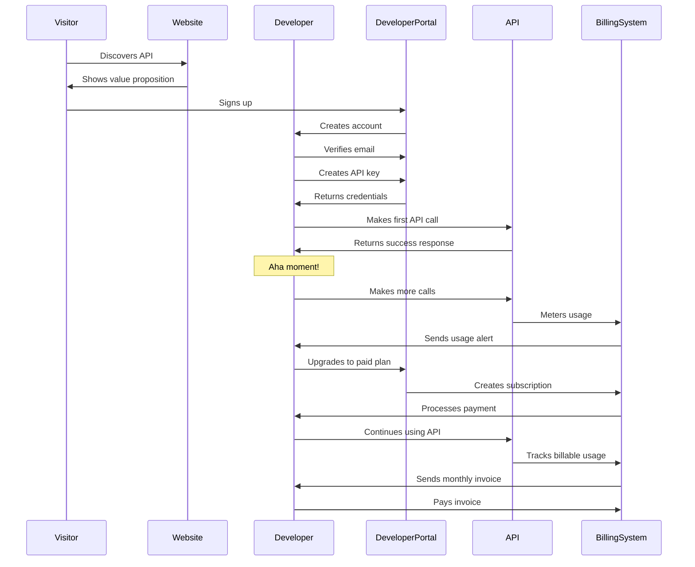
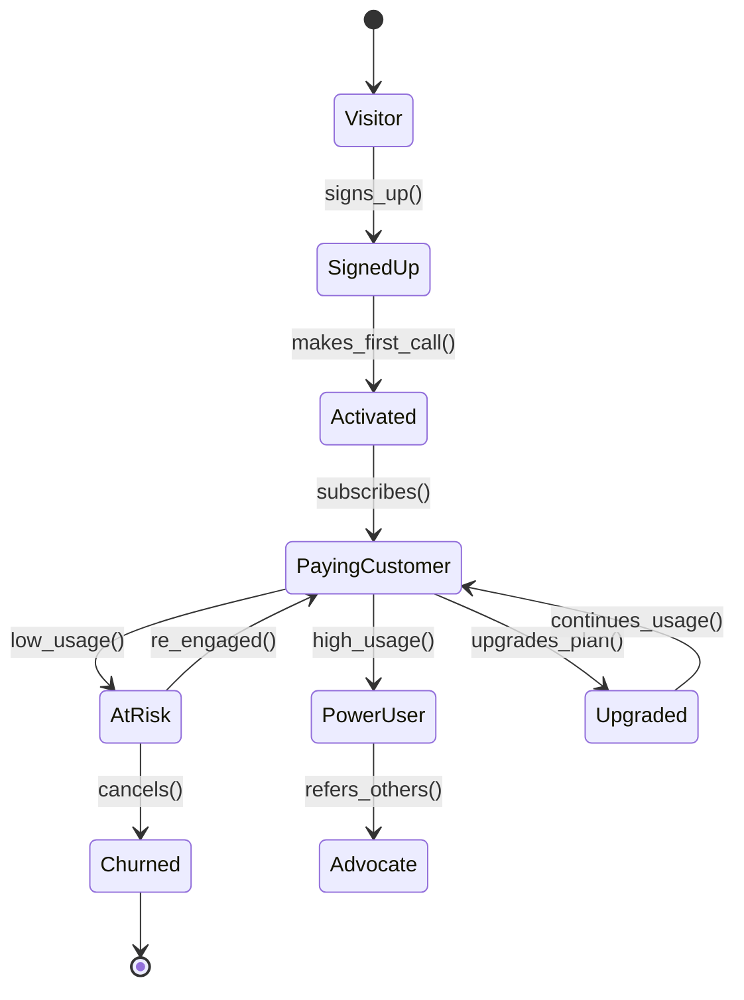
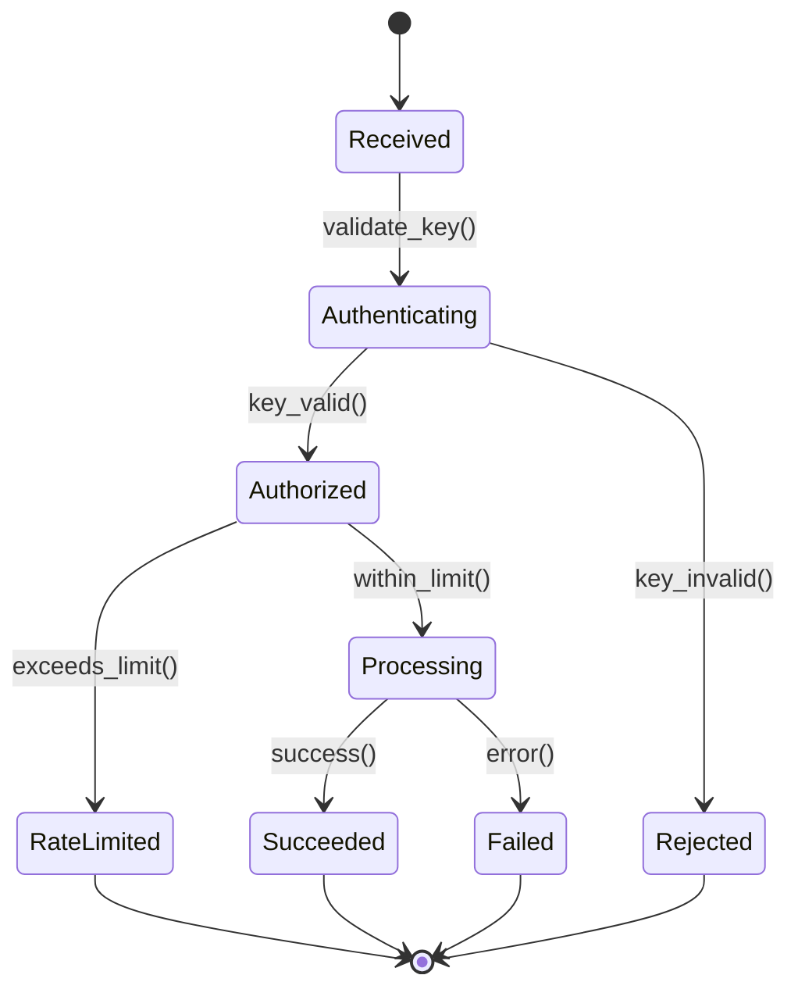
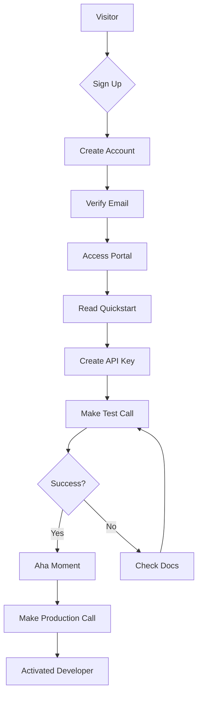
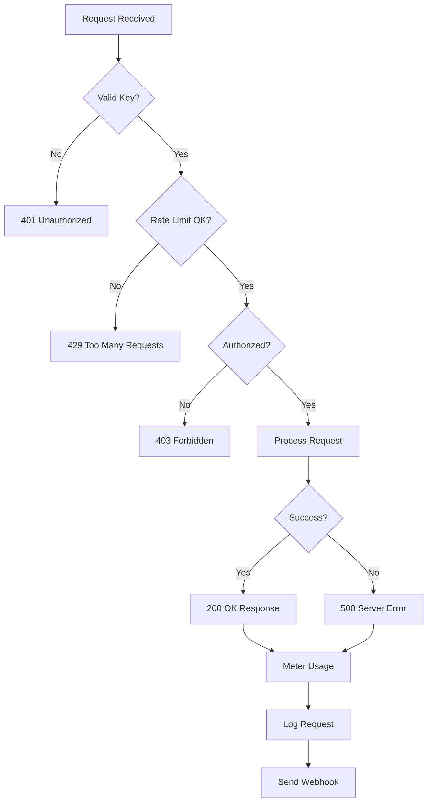
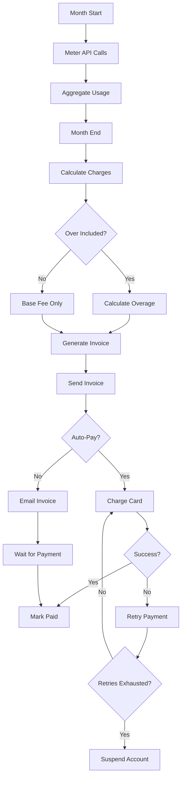

# APIBusiness Operational Model

## Core Abstraction

An APIBusiness provides programmatic access to functionality or data, serving developers as customers with usage-based or subscription pricing.

## GraphDL Statements

```graphdl
APIBusiness.isA.OnlineBusiness
APIBusiness.exposes.API
APIBusiness.serves.Developer
APIBusiness.provides.Endpoint
APIBusiness.manages.RateLimit
APIBusiness.issues.APIKey
APIBusiness.tracks.Usage
APIBusiness.bills.PerCall
APIBusiness.bills.PerMonth
APIBusiness.maintains.Documentation
APIBusiness.provides.SDK
APIBusiness.manages.Version
APIBusiness.ensures.Uptime
APIBusiness.monitors.Latency
APIBusiness.provides.Webhook
APIBusiness.handles.Authentication
```

## Nouns (Entities)

### Core Entities

**Developer** (Customer)
- Properties: email, company, role, timezone, createdAt
- States: visitor, signed_up, activated, paying, churned
- Actions: signs_up, creates_key, makes_call, upgrades, churns

**APIKey**
- Properties: key, secret, environment, permissions, rateLimit, createdAt, lastUsed
- States: active, rate_limited, revoked, expired
- Actions: created, rotated, revoked, rate_limited

**Endpoint**
- Properties: path, method, version, deprecated, rateLimit, averageLatency
- States: active, deprecated, sunset, offline
- Actions: called, rate_limited, errored, succeeded

**Request**
- Properties: requestId, timestamp, endpoint, method, statusCode, latency, apiKey
- States: queued, processing, completed, failed, rate_limited
- Actions: received, authenticated, authorized, executed, responded

**Usage**
- Properties: apiKey, endpoint, count, timestamp, cost
- States: metered, billed, unpaid, paid
- Actions: tracked, aggregated, billed, paid

**Subscription**
- Properties: plan, tier, billing_period, requests_included, overage_rate
- States: trial, active, past_due, canceled, expired
- Actions: created, upgraded, downgraded, renewed, canceled

### Financial Entities

**Invoice**
- Properties: amount, period, requests, overages, status, dueDate
- States: draft, issued, paid, overdue, void
- Actions: generated, sent, paid, refunded

**Payment**
- Properties: amount, method, status, transactionId, timestamp
- States: pending, succeeded, failed, refunded
- Actions: initiated, processed, confirmed, failed

### Product Entities

**SDK**
- Properties: language, version, downloads, lastUpdated
- States: alpha, beta, stable, deprecated
- Actions: released, updated, deprecated

**Webhook**
- Properties: url, events, secret, retryPolicy
- States: active, disabled, failed
- Actions: registered, triggered, delivered, failed, retried

**Documentation**
- Properties: endpoint, description, examples, changelog
- States: draft, published, outdated
- Actions: written, published, updated

## Properties by Entity

### Developer Properties
```typescript
interface Developer {
  id: string
  email: string
  name: string
  company: string
  role: 'individual' | 'team' | 'enterprise'
  timezone: string
  plan: 'free' | 'starter' | 'pro' | 'enterprise'
  mrr: number
  apiKeys: APIKey[]
  createdAt: Date
  lastActiveAt: Date
  activatedAt?: Date
  convertedAt?: Date
}
```

### APIKey Properties
```typescript
interface APIKey {
  id: string
  key: string
  secret: string
  developerId: string
  name: string
  environment: 'development' | 'staging' | 'production'
  permissions: string[]
  rateLimit: {
    requests: number
    window: 'second' | 'minute' | 'hour' | 'day'
  }
  ipWhitelist?: string[]
  createdAt: Date
  lastUsedAt?: Date
  expiresAt?: Date
  revokedAt?: Date
}
```

### Request Properties
```typescript
interface Request {
  id: string
  timestamp: Date
  apiKey: string
  endpoint: string
  method: 'GET' | 'POST' | 'PUT' | 'PATCH' | 'DELETE'
  path: string
  queryParams: Record<string, any>
  headers: Record<string, string>
  body?: any
  response: {
    statusCode: number
    latency: number
    size: number
    body?: any
  }
  ip: string
  userAgent: string
  cost: number
}
```

## Actions (Verbs)

### Developer Actions
- `signs_up()` - Creates account
- `verifies_email()` - Confirms email
- `creates_api_key()` - Generates credentials
- `makes_first_call()` - Activates
- `reads_documentation()` - Learns
- `joins_community()` - Engages
- `subscribes_to_plan()` - Converts
- `upgrades_plan()` - Expands
- `cancels_subscription()` - Churns
- `refers_developer()` - Advocates

### System Actions
- `authenticates()` - Verifies API key
- `authorizes()` - Checks permissions
- `rate_limits()` - Enforces limits
- `meters_usage()` - Tracks consumption
- `bills_usage()` - Calculates charges
- `sends_webhook()` - Notifies event
- `logs_request()` - Records call
- `caches_response()` - Optimizes performance
- `retries_failed()` - Handles errors

## Events

### Developer Events
```
developer.signed_up
developer.email_verified
developer.api_key_created
developer.first_call_made
developer.activated
developer.subscribed
developer.upgraded
developer.downgraded
developer.churned
developer.referred
```

### API Events
```
api.request.received
api.request.authenticated
api.request.authorized
api.request.rate_limited
api.request.succeeded
api.request.failed
api.endpoint.deprecated
api.version.released
api.outage.detected
api.outage.resolved
```

### Billing Events
```
usage.metered
usage.threshold_reached
invoice.generated
invoice.sent
payment.succeeded
payment.failed
subscription.created
subscription.renewed
subscription.canceled
```

## Entity Relationship Diagram



## Customer Journey Sequence



## State Diagram: Developer Lifecycle



## State Diagram: Request Lifecycle



## Core Metrics/KPIs

### Developer Metrics
```
Total Developers
Active Developers (made call in last 30 days)
Activated Developers (made first call)
Paying Developers
Developer Activation Rate
Developer Retention (30/60/90 day)
Developer Churn Rate
Average Developers per Account
```

### API Usage Metrics
```
Total API Calls
Calls per Second (peak, average)
Success Rate (2xx responses)
Error Rate (4xx, 5xx)
Average Latency (p50, p95, p99)
Uptime (99.9%, 99.99%)
Rate Limit Hit Rate
```

### Financial Metrics
```
MRR (Monthly Recurring Revenue)
ARR (Annual Recurring Revenue)
ARPU (Average Revenue Per User)
Usage Revenue (overage charges)
Revenue per 1000 Calls
LTV (Lifetime Value)
CAC (Customer Acquisition Cost)
Gross Margin
```

### Product Metrics
```
Documentation Page Views
SDK Downloads
API Key Creations
Time to First Call
Calls per Developer
Endpoint Adoption Rate
Version Distribution
Webhook Success Rate
```

## Financial Systems

```graphdl
APIBusiness.uses.StripeConnect
APIBusiness.uses.PlatformDo
APIBusiness.meters.Usage
APIBusiness.calculates.Overage
APIBusiness.generates.Invoice
APIBusiness.processes.Payment

StripeConnect.creates.Customer
StripeConnect.creates.Subscription
StripeConnect.tracks.UsageRecord
StripeConnect.calculates.ProrationBilling
StripeConnect.sends.Invoice
StripeConnect.processes.Payment

PlatformDo.provisions.DeveloperAccount
PlatformDo.manages.APIKey
PlatformDo.meters.APICall
PlatformDo.enforces.RateLimit
PlatformDo.aggregates.Usage
PlatformDo.calculates.Bill
```

### Pricing Models

**Freemium**
```
Free Tier: 1,000 requests/month
Starter: $29/month + $0.01/request over 10K
Pro: $99/month + $0.005/request over 100K
Enterprise: Custom pricing
```

**Usage-Based**
```
$0.01 per request
Volume discounts at 1M, 10M, 100M
Real-time metering
Monthly billing
```

**Tiered**
```
Tier 1: $0.01/request (0-100K)
Tier 2: $0.008/request (100K-1M)
Tier 3: $0.005/request (1M-10M)
Tier 4: Custom (10M+)
```

## Teams & Responsibilities

### Developer Relations Team
```graphdl
DevRelTeam.creates.Documentation
DevRelTeam.maintains.SDK
DevRelTeam.provides.TechnicalSupport
DevRelTeam.builds.Community
DevRelTeam.creates.Tutorial
DevRelTeam.speaks.AtConference

DevRelTeam.employs.DeveloperAdvocate
DevRelTeam.employs.TechnicalWriter
DevRelTeam.employs.CommunityManager
DevRelTeam.employs.DeveloperSuccessEngineer
```

### Platform Engineering Team
```graphdl
PlatformTeam.builds.API
PlatformTeam.maintains.Infrastructure
PlatformTeam.monitors.Performance
PlatformTeam.ensures.Uptime
PlatformTeam.scales.Capacity
PlatformTeam.optimizes.Latency

PlatformTeam.employs.APIEngineer
PlatformTeam.employs.InfrastructureEngineer
PlatformTeam.employs.SREEngineer
PlatformTeam.employs.SecurityEngineer
```

### Growth Team
```graphdl
GrowthTeam.acquires.Developer
GrowthTeam.activates.Developer
GrowthTeam.converts.ToPaid
GrowthTeam.expands.Usage
GrowthTeam.optimizes.Funnel

GrowthTeam.employs.GrowthEngineer
GrowthTeam.employs.ProductMarketer
GrowthTeam.employs.DataAnalyst
```

## Systems & Tools

### Developer Portal Stack
```
Portal: Next.js, React
Authentication: Auth0, Clerk
API Management: Kong, Apigee, AWS API Gateway
Documentation: ReadMe, GitBook, Docusaurus
Code Examples: GitHub, CodeSandbox
```

### Infrastructure Stack
```
API Gateway: Kong, AWS API Gateway, Cloudflare
Load Balancer: Nginx, HAProxy, AWS ALB
Rate Limiting: Redis, Kong
Caching: Redis, Cloudflare, Fastly
Monitoring: Datadog, New Relic
Logging: Elasticsearch, Splunk
Alerting: PagerDuty, Opsgenie
```

### Metering & Billing Stack
```
Usage Metering: Stripe Billing, Orb, m3ter
Analytics: Mixpanel, Amplitude
Business Intelligence: Metabase, Looker
Invoicing: Stripe, Chargebee
Payment Processing: Stripe
```

## Core Processes

### Developer Onboarding Flow



### API Request Flow



### Billing Cycle



## Autonomous Operations

### AI Agent Assignments

```graphdl
AIDeveloperSupportAgent.answers.TechnicalQuestion
AIDeveloperSupportAgent.debugs.IntegrationIssue
AIDeveloperSupportAgent.generates.CodeExample
AIDeveloperSupportAgent.updates.Documentation

AIOnboardingAgent.guides.NewDeveloper
AIOnboardingAgent.suggests.Integration
AIOnboardingAgent.troubleshoots.FirstCall
AIOnboardingAgent.celebrates.Success

AIDocumentationAgent.writes.APIReference
AIDocumentationAgent.creates.Tutorial
AIDocumentationAgent.generates.SDKExample
AIDocumentationAgent.maintains.Changelog

AIMonitoringAgent.detects.Anomaly
AIMonitoringAgent.predicts.Outage
AIMonitoringAgent.optimizes.Performance
AIMonitoringAgent.alerts.Team

AIGrowthAgent.identifies.UpgradeOpportunity
AIGrowthAgent.personalizes.Recommendation
AIGrowthAgent.optimizes.Pricing
AIGrowthAgent.predicts.Churn
```

## OKRs Example

### Objective: Achieve Developer Love

**Key Results:**
- NPS score of 60+
- Documentation rating of 4.5/5
- Average time to first call: <10 minutes
- Support response time: <2 hours

### Objective: Scale API Usage

**Key Results:**
- 10 billion API calls/month
- 99.99% uptime
- p99 latency <200ms
- 10,000 active developers

### Objective: Grow Revenue

**Key Results:**
- $1M ARR
- 500 paying developers
- ARPU of $200/month
- LTV/CAC ratio of 5+
