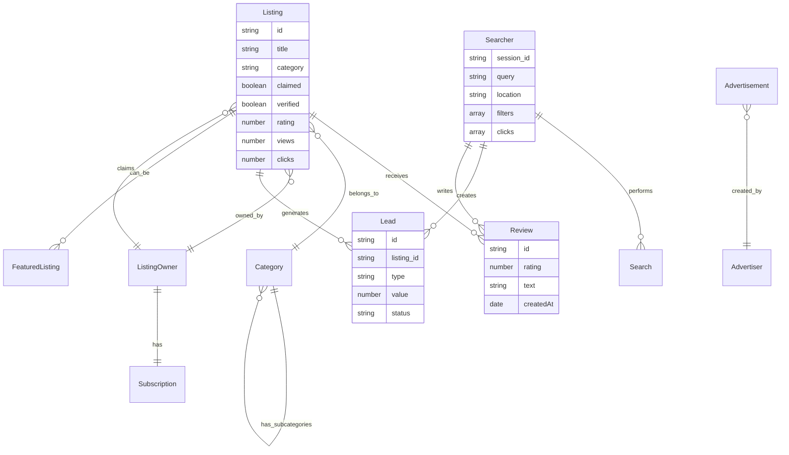
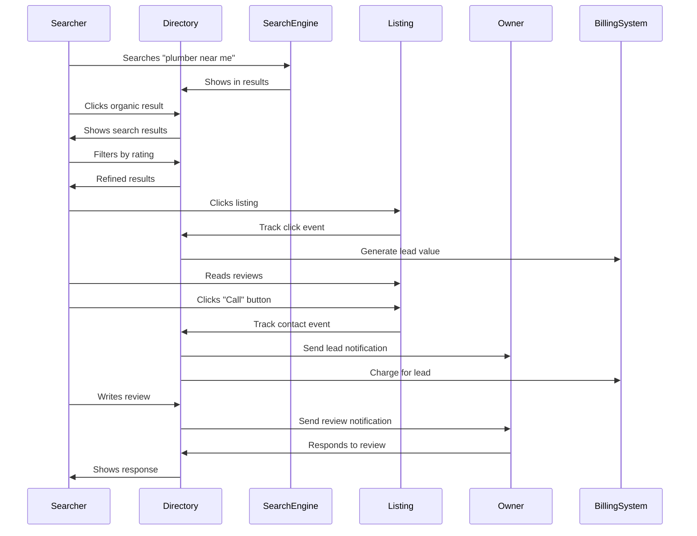
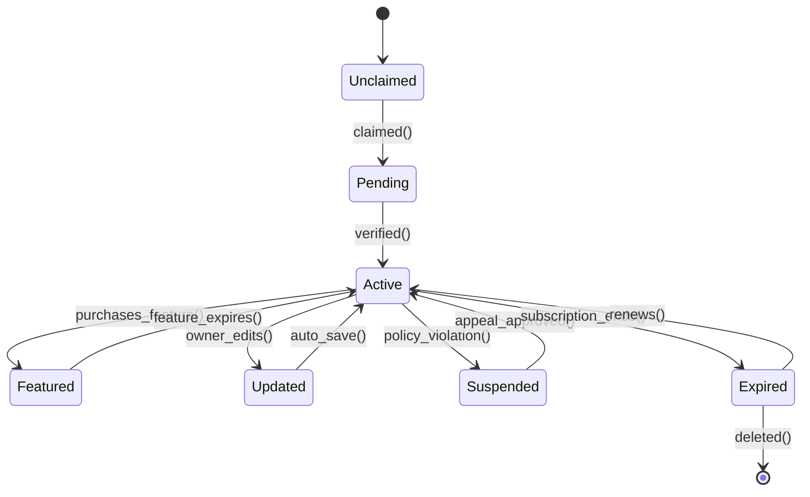
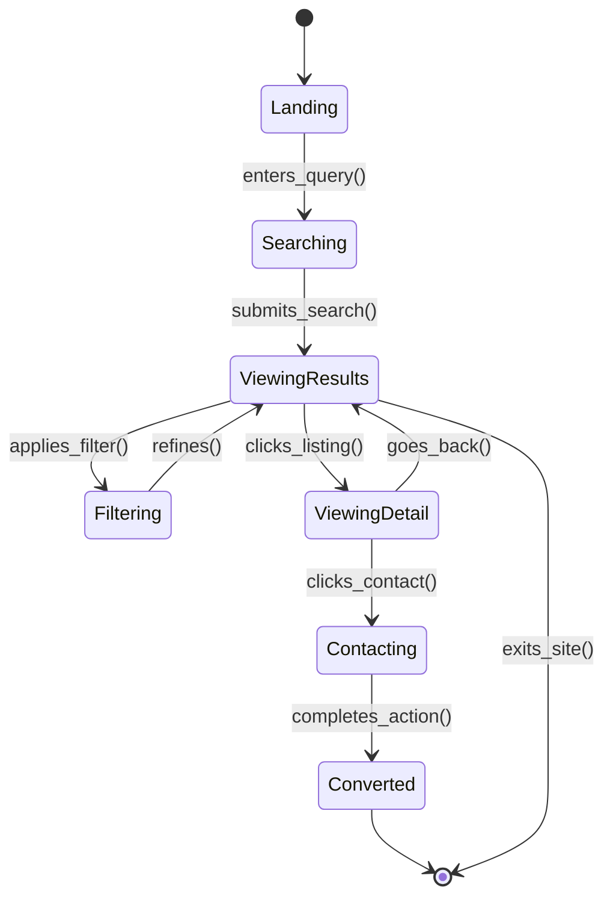
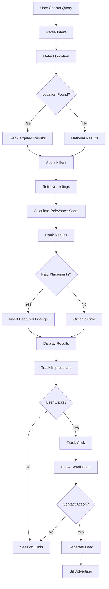
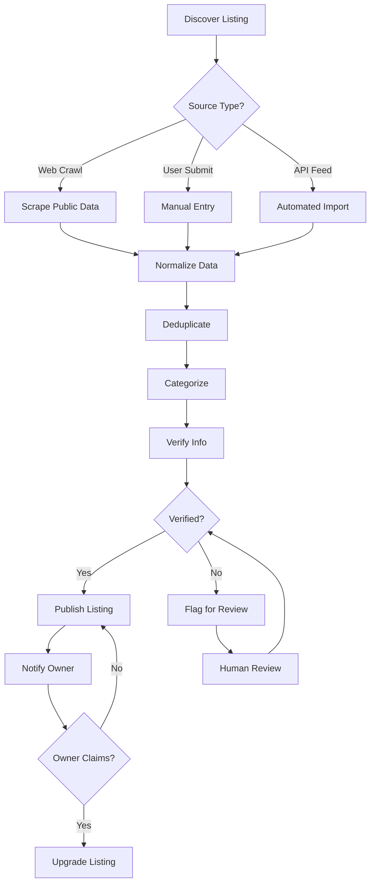
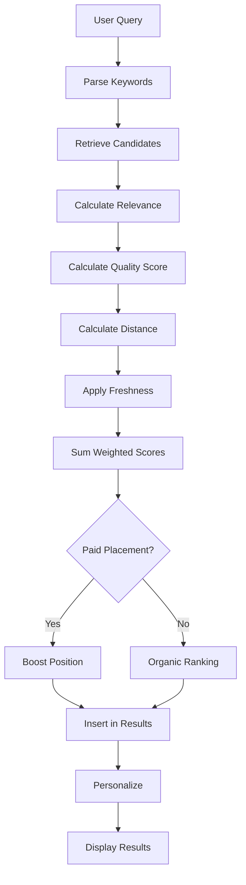
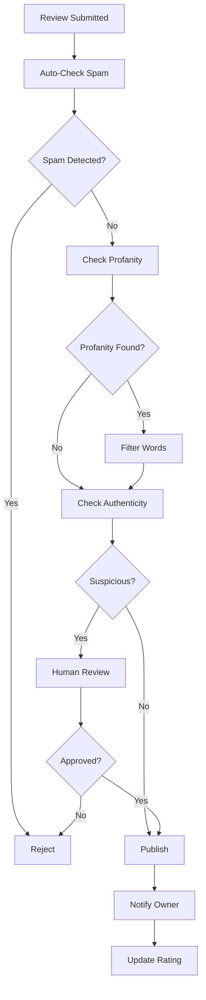

# DirectoryBusiness Operational Model

## Core Abstraction

A DirectoryBusiness aggregates, curates, and enables discovery of listings (businesses, jobs, properties, products) while monetizing through advertising, featured placements, and lead generation.

## GraphDL Statements

```graphdl
DirectoryBusiness.isA.OnlineBusiness
DirectoryBusiness.aggregates.Listing
DirectoryBusiness.enables.Discovery
DirectoryBusiness.provides.Search
DirectoryBusiness.curates.Content
DirectoryBusiness.verifies.Listing
DirectoryBusiness.categorizes.Entry
DirectoryBusiness.ranks.Result
DirectoryBusiness.optimizes.SEO
DirectoryBusiness.generates.Lead
DirectoryBusiness.charges.ListingFee
DirectoryBusiness.sells.Advertisement
DirectoryBusiness.offers.FeaturedPlacement
DirectoryBusiness.provides.Review
DirectoryBusiness.provides.Rating
DirectoryBusiness.manages.Claim
DirectoryBusiness.updates.Information
DirectoryBusiness.tracks.Traffic
DirectoryBusiness.monetizes.Click
```

## Nouns (Entities)

### Core Entities

**Listing**
- Properties: id, title, description, category, location, contact, photos, status, claimed
- States: pending, active, featured, expired, suspended, claimed
- Actions: created, claimed, verified, featured, updated, expired

**ListingOwner**
- Properties: name, email, phone, company, listings, subscription
- States: free, basic, premium, enterprise
- Actions: claims_listing, updates_info, upgrades_plan, responds_to_review

**Searcher** (End User)
- Properties: session_id, search_query, location, filters, click_history
- States: browsing, searching, engaged, converted
- Actions: searches, filters, clicks, saves, contacts, reviews

**Category**
- Properties: name, slug, parent, subcategories, listing_count, icon
- States: active, hidden
- Actions: created, populated, optimized

**Review**
- Properties: listing_id, author, rating, text, photos, helpful_count
- States: pending, published, flagged, removed
- Actions: submitted, moderated, published, responded_to

**Lead**
- Properties: searcher, listing, type, value, status
- States: generated, contacted, qualified, converted, lost
- Actions: captured, sent, tracked, converted

### Monetization Entities

**Advertisement**
- Properties: advertiser, creative, targeting, bid, budget, impressions, clicks
- States: draft, active, paused, completed
- Actions: created, approved, served, clicked, converted

**FeaturedListing**
- Properties: listing_id, placement, duration, cost, impressions, clicks
- States: pending, active, expired
- Actions: purchased, activated, renewed, expired

**Subscription**
- Properties: owner, tier, listings_included, features, mrr
- States: trial, active, past_due, canceled
- Actions: started, upgraded, renewed, canceled

## Properties by Entity

### Listing Properties
```typescript
interface Listing {
  id: string
  title: string
  description: string
  slug: string
  category_id: string
  subcategories: string[]
  owner_id?: string
  claimed: boolean
  verified: boolean
  status: 'pending' | 'active' | 'featured' | 'expired' | 'suspended'
  contact: {
    email?: string
    phone?: string
    website?: string
    address?: Address
  }
  hours?: BusinessHours
  photos: string[]
  logo?: string
  rating: {
    average: number
    count: number
  }
  reviews: number
  featured_until?: Date
  views: number
  clicks: number
  leads: number
  seo: {
    meta_title: string
    meta_description: string
    keywords: string[]
  }
  createdAt: Date
  updatedAt: Date
}
```

### Searcher Properties
```typescript
interface Searcher {
  session_id: string
  user_id?: string
  search_query: string
  location?: {
    lat: number
    lng: number
    city: string
    state: string
    country: string
  }
  filters: {
    category?: string[]
    rating?: number
    price?: string
    distance?: number
    open_now?: boolean
  }
  results_viewed: string[]
  listings_clicked: string[]
  listings_contacted: string[]
  device: string
  source: string
  createdAt: Date
}
```

### Lead Properties
```typescript
interface Lead {
  id: string
  listing_id: string
  searcher_id: string
  type: 'click' | 'call' | 'email' | 'message' | 'booking'
  metadata: {
    source: string
    campaign?: string
    search_query?: string
  }
  value: number
  status: 'generated' | 'contacted' | 'qualified' | 'converted' | 'lost'
  createdAt: Date
}
```

## Actions (Verbs)

### Searcher Actions
- `searches()` - Queries directory
- `filters()` - Refines results
- `clicks()` - Views listing detail
- `saves()` - Bookmarks listing
- `contacts()` - Reaches out to business
- `calls()` - Phones business
- `visits()` - Goes to location
- `reviews()` - Writes review
- `shares()` - Shares listing

### Listing Owner Actions
- `claims_listing()` - Takes ownership
- `verifies_info()` - Confirms details
- `updates_listing()` - Modifies content
- `uploads_photos()` - Adds images
- `responds_to_review()` - Engages feedback
- `purchases_featured()` - Buys placement
- `upgrades_subscription()` - Expands features
- `views_analytics()` - Checks performance

### System Actions
- `crawls_web()` - Discovers listings
- `aggregates_data()` - Collects information
- `verifies_listing()` - Validates accuracy
- `categorizes()` - Organizes entries
- `ranks_results()` - Orders by relevance
- `serves_ad()` - Shows advertisement
- `tracks_click()` - Monitors engagement
- `generates_lead()` - Creates opportunity
- `bills_advertiser()` - Charges for service

## Events

### Listing Events
```
listing.created
listing.claimed
listing.verified
listing.updated
listing.featured
listing.expired
listing.reviewed
listing.rated
listing.viewed
listing.clicked
listing.contacted
```

### Searcher Events
```
search.performed
results.displayed
filter.applied
listing.clicked
listing.saved
contact.initiated
review.submitted
lead.generated
```

### Monetization Events
```
featured.purchased
subscription.started
subscription.upgraded
ad.served
ad.clicked
lead.converted
invoice.generated
payment.received
```

## Entity Relationship Diagram



## User Journey Sequence



## State Diagram: Listing Lifecycle



## State Diagram: Search Session



## Search & Discovery Flow



## Core Metrics/KPIs

### Traffic Metrics
```
Monthly Visitors
Monthly Searches
Page Views per Session
Bounce Rate
Average Session Duration
Return Visitor Rate
Organic Search Traffic
Direct Traffic
Referral Traffic
```

### Listing Metrics
```
Total Listings
Active Listings
Claimed Listings
Verified Listings
Featured Listings
Average Listing Quality Score
Listing Growth Rate
Claim Rate
Verification Rate
```

### Engagement Metrics
```
Search-to-Click Rate
Click-Through Rate (CTR)
Listing Detail Page Views
Contact Rate (contacts / views)
Review Submission Rate
Photos per Listing
Listings Saved
Repeat Searches
```

### Monetization Metrics
```
Total Revenue
Ad Revenue
Featured Listing Revenue
Subscription Revenue
Lead Gen Revenue
Revenue per Search
Revenue per Listing
ARPU (Average Revenue Per User)
LTV (Listing Owner Lifetime Value)
```

### Lead Quality Metrics
```
Leads Generated
Lead-to-Contact Rate
Lead-to-Conversion Rate
Lead Value
Cost per Lead
Lead Quality Score
Advertiser ROI
```

## Financial Systems

```graphdl
DirectoryBusiness.uses.Stripe
DirectoryBusiness.charges.Subscription
DirectoryBusiness.bills.FeaturedPlacement
DirectoryBusiness.processes.AdPayment
DirectoryBusiness.tracks.LeadValue
DirectoryBusiness.calculates.Commission

Stripe.creates.Customer
Stripe.creates.Subscription
Stripe.charges.OneTime
Stripe.tracks.Usage
Stripe.generates.Invoice
Stripe.manages.Payout

AdPlatform.serves.Advertisement
AdPlatform.tracks.Impression
AdPlatform.tracks.Click
AdPlatform.calculates.CPC
AdPlatform.bills.Advertiser
```

### Pricing Models

**Listing Subscription**
```
Free:
- Basic listing
- Limited photos (3)
- No featured placement

Basic ($29/month):
- Enhanced listing
- Unlimited photos
- Priority in search
- Basic analytics

Premium ($99/month):
- Featured placement
- Top of category
- Advanced analytics
- Lead notifications
- Review management

Enterprise (Custom):
- Multiple locations
- API access
- Custom integrations
- Dedicated support
```

**Featured Placement**
```
Category Featured: $199/month
Homepage Featured: $499/month
Premium Boost: $99/week
Sponsored Results: $2-10 CPC
```

**Advertisement**
```
Display Ads: CPM ($5-20)
Sponsored Listings: CPC ($1-5)
Email Campaigns: Per send ($0.10-0.50)
Lead Generation: Per lead ($5-50)
```

## Teams & Responsibilities

### Content Team
```graphdl
ContentTeam.aggregates.Listing
ContentTeam.verifies.Information
ContentTeam.moderates.Review
ContentTeam.curates.Category
ContentTeam.optimizes.SEO

ContentTeam.employs.ContentModerator
ContentTeam.employs.DataSpecialist
ContentTeam.employs.SEOSpecialist
ContentTeam.employs.QAAnalyst
```

### Sales Team
```graphdl
SalesTeam.sells.Subscription
SalesTeam.sells.FeaturedPlacement
SalesTeam.sells.Advertisement
SalesTeam.manages.Enterprise

SalesTeam.employs.SalesRep
SalesTeam.employs.AccountManager
SalesTeam.employs.BusinessDevelopment
```

### Engineering Team
```graphdl
EngineeringTeam.builds.SearchEngine
EngineeringTeam.maintains.Platform
EngineeringTeam.optimizes.Performance
EngineeringTeam.develops.Feature

EngineeringTeam.employs.BackendEngineer
EngineeringTeam.employs.FrontendEngineer
EngineeringTeam.employs.SearchEngineer
EngineeringTeam.employs.DevOpsEngineer
```

### Customer Success Team
```graphdl
CSTeam.supports.ListingOwner
CSTeam.resolves.Issue
CSTeam.drives.Adoption
CSTeam.identifies.Upsell

CSTeam.employs.SupportAgent
CSTeam.employs.SuccessManager
CSTeam.employs.OnboardingSpecialist
```

## Systems & Tools

### Core Platform
```
Search: Elasticsearch, Algolia, Typesense
Database: PostgreSQL
Cache: Redis
CDN: Cloudflare
Storage: S3
```

### SEO & Marketing
```
SEO: Ahrefs, SEMrush, Screaming Frog
Analytics: Google Analytics, Mixpanel
Ads: Google Ads, Facebook Ads
Email: SendGrid, Mailgun
```

### Monetization
```
Ad Server: Google Ad Manager, Adzerk
Billing: Stripe, Chargebee
Analytics: Google Analytics, Metabase
Attribution: Segment, Rudderstack
```

### Content Management
```
CMS: Custom admin panel
Moderation: Custom tools
Images: Cloudinary, Imgix
Maps: Google Maps API, Mapbox
Scraping: Custom crawlers, Apify
```

## Core Processes

### Listing Acquisition



### Search Ranking Algorithm



### Review Moderation



## Autonomous Operations

### AI Agent Assignments

```graphdl
AIContentAgent.aggregates.Listing
AIContentAgent.extracts.Information
AIContentAgent.normalizes.Data
AIContentAgent.categorizes.Listing
AIContentAgent.detects.Duplicate

AIModerationAgent.reviews.Listing
AIModerationAgent.detects.Spam
AIModerationAgent.filters.Profanity
AIModerationAgent.validates.Review
AIModerationAgent.flags.Violation

AISEOAgent.optimizes.Title
AISEOAgent.generates.Description
AISEOAgent.suggests.Keywords
AISEOAgent.improves.Metadata
AISEOAgent.builds.Backlinks

AISearchAgent.understands.Intent
AISearchAgent.personalizes.Results
AISearchAgent.recommends.Listing
AISearchAgent.suggests.Refinement
AISearchAgent.predicts.Conversion

AISalesAgent.identifies.UpgradeOpportunity
AISalesAgent.personalizes.Pitch
AISalesAgent.follows.Up
AISalesAgent.nurtures.Lead
AISalesAgent.predicts.Churn
```

## OKRs Example

### Objective: Become Category Leader

**Key Results:**
- 1M listings in directory
- 10M monthly searches
- #1 ranking for 100 target keywords
- 50K claimed listings

### Objective: Maximize Monetization

**Key Results:**
- $2M ARR from subscriptions
- $1M ARR from featured placements
- $500K ARR from advertising
- 20% of listings on paid plans

### Objective: Optimize User Experience

**Key Results:**
- Average session duration >3 minutes
- Search-to-click rate >30%
- Contact rate >5%
- Review submission rate >10%

### Objective: Improve Quality

**Key Results:**
- 80% of listings claimed
- 90% of listings verified
- Average listing quality score >4.0
- Spam/fake listing rate <1%
