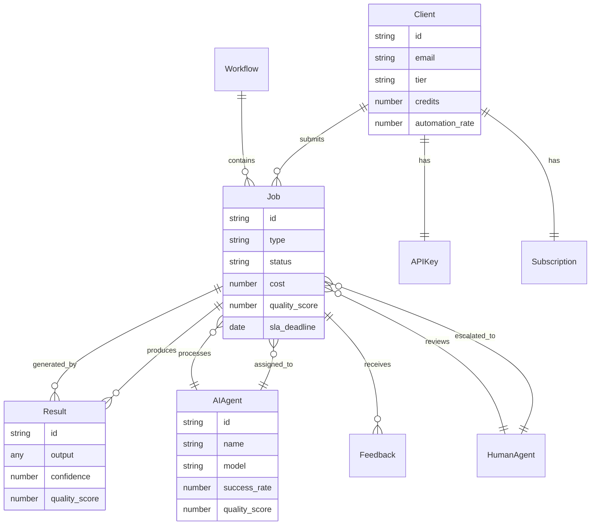
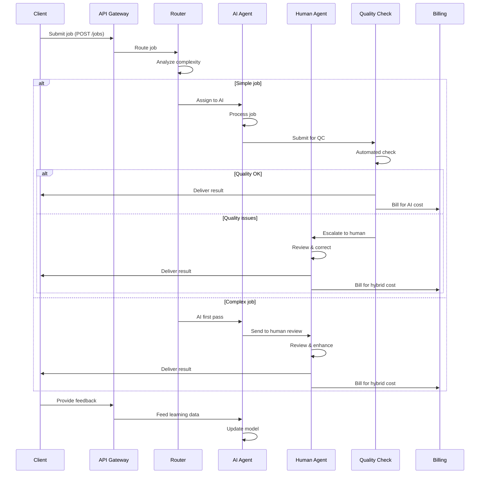
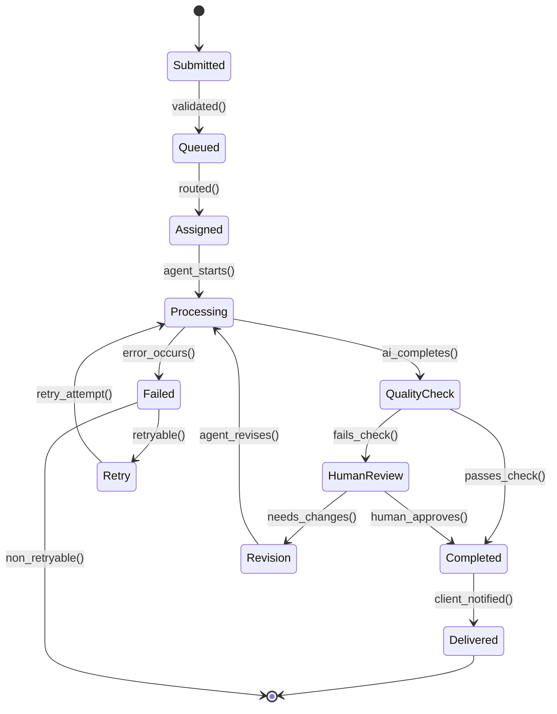
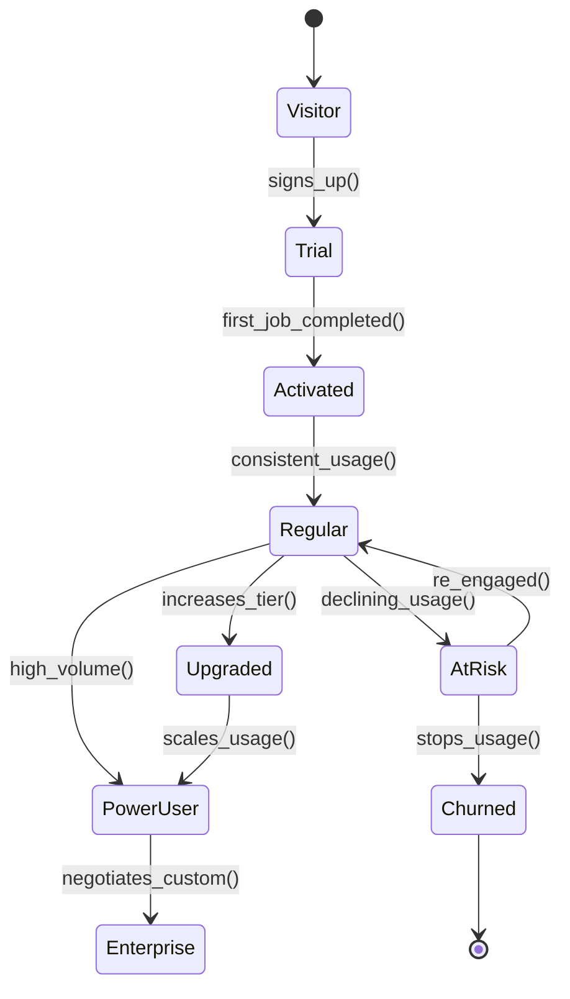
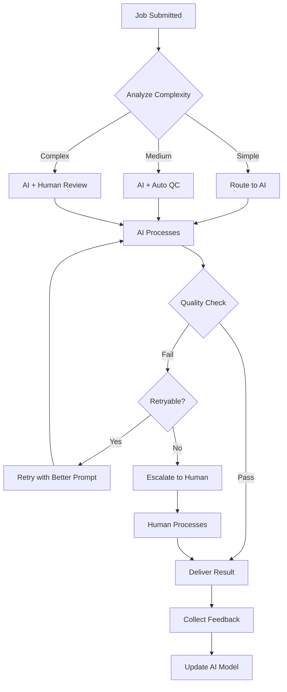
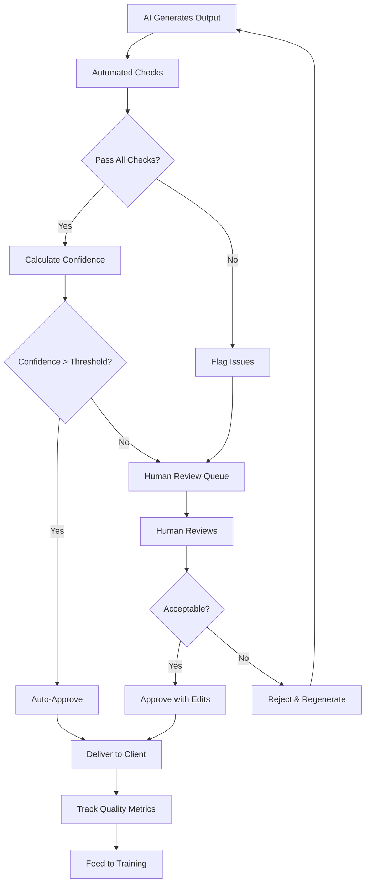
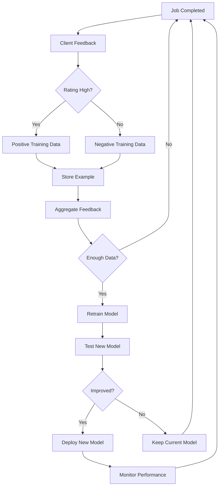

# SaS (Services-as-Software) Operational Model

## Core Abstraction

Services-as-Software (SaS) delivers traditionally human-performed services via AI agents and automation, combining the scalability of software with the outcomes of professional services.

## GraphDL Statements

```graphdl
SaS.isA.OnlineBusiness
SaS.delivers.ServiceAsSoftware
SaS.employs.AIAgent
SaS.automates.HumanTask
SaS.replaces.HumanLabor
SaS.augments.HumanWork
SaS.scales.Infinitely
SaS.operates.Autonomously
SaS.charges.PerExecution
SaS.charges.PerOutcome
SaS.provides.API
SaS.integrates.ViaWebhook
SaS.processes.Asynchronously
SaS.delivers.Instantly
SaS.operates.24x7
SaS.eliminates.WaitTime
SaS.reduces.Cost
SaS.ensures.Consistency
SaS.learns.FromData
SaS.improves.Continuously
SaS.handles.EdgeCase
SaS.escalates.ToHuman
SaS.combines.MultipleAI
SaS.orchestrates.Workflow
```

## Nouns (Entities)

### Core Entities

**Client** (Customer)
- Properties: email, company, industry, use_case, api_key, tier
- States: trial, active, power_user, churned
- Actions: signs_up, submits_job, receives_result, provides_feedback, upgrades

**Job** (Service Request)
- Properties: id, type, input, output, status, duration, cost, quality_score
- States: queued, processing, completed, failed, human_review
- Actions: submitted, assigned, processed, completed, failed, reviewed

**AIAgent**
- Properties: name, capability, model, version, cost_per_execution, success_rate
- States: idle, processing, learning, updating
- Actions: receives_job, processes, generates_output, learns, improves

**HumanAgent** (Backup/QA)
- Properties: name, expertise, availability, hourly_rate
- States: available, busy, offline
- Actions: reviews, corrects, approves, escalates

**Workflow**
- Properties: steps, dependencies, sla, automation_rate
- States: active, paused, completed
- Actions: triggered, executed, completed

**Result**
- Properties: job_id, output, quality_score, processing_time, cost
- States: draft, approved, delivered, revised
- Actions: generated, reviewed, approved, delivered, rejected

### Service-Specific Entities

**ContentJob** (for AI Writing)
- Properties: topic, tone, length, keywords, target_audience
- States: drafted, edited, published
- Actions: researched, written, edited, optimized

**ResearchJob** (for AI Research)
- Properties: query, sources, depth, format
- States: gathering, analyzing, synthesizing, completed
- Actions: searched, analyzed, cited, summarized

**AnalysisJob** (for AI Data Analysis)
- Properties: dataset, question, visualization, insights
- States: loading, analyzing, visualizing, completed
- Actions: ingested, processed, visualized, interpreted

**CodeJob** (for AI Code Generation)
- Properties: language, framework, requirements, tests
- States: generating, testing, reviewing, delivered
- Actions: generated, tested, reviewed, deployed

## Properties by Entity

### Client Properties
```typescript
interface Client {
  id: string
  email: string
  company: string
  industry: string
  use_case: string
  tier: 'free' | 'starter' | 'pro' | 'enterprise'
  api_key: string
  credits: number
  jobs_submitted: number
  jobs_completed: number
  avg_quality_score: number
  automation_rate: number
  cost_savings: number
  createdAt: Date
  lastJobAt?: Date
}
```

### Job Properties
```typescript
interface Job {
  id: string
  client_id: string
  type: 'writing' | 'research' | 'analysis' | 'code' | 'design' | 'support'
  input: {
    prompt: string
    context?: any
    requirements: string[]
    constraints?: any
  }
  output?: {
    result: any
    confidence: number
    sources?: string[]
    alternatives?: any[]
  }
  status: 'queued' | 'processing' | 'completed' | 'failed' | 'human_review'
  assigned_to: 'ai' | 'human' | 'hybrid'
  ai_agent_id?: string
  human_agent_id?: string
  processing_time: number
  cost: number
  quality_score?: number
  feedback?: {
    rating: number
    comments: string
  }
  createdAt: Date
  completedAt?: Date
  sla_deadline: Date
}
```

### AIAgent Properties
```typescript
interface AIAgent {
  id: string
  name: string
  type: 'writer' | 'researcher' | 'analyst' | 'coder' | 'designer'
  model: string
  version: string
  capabilities: string[]
  cost_per_execution: number
  avg_processing_time: number
  success_rate: number
  quality_score: number
  jobs_completed: number
  status: 'idle' | 'processing' | 'learning' | 'updating'
  current_load: number
  max_concurrent_jobs: number
  specialized_in: string[]
}
```

## Actions (Verbs)

### Client Actions
- `signs_up()` - Creates account
- `generates_api_key()` - Gets credentials
- `submits_job()` - Requests service
- `tracks_progress()` - Monitors status
- `receives_result()` - Gets output
- `provides_feedback()` - Rates quality
- `requests_revision()` - Asks for changes
- `approves_result()` - Accepts deliverable
- `upgrades_tier()` - Expands usage
- `integrates_api()` - Automates workflow

### AIAgent Actions
- `receives_job()` - Gets assignment
- `analyzes_requirements()` - Understands task
- `processes_input()` - Executes work
- `generates_output()` - Produces result
- `self_evaluates()` - Checks quality
- `escalates()` - Sends to human
- `learns_from_feedback()` - Improves
- `updates_model()` - Gets better

### System Actions
- `routes_job()` - Assigns to agent
- `monitors_quality()` - Checks output
- `enforces_sla()` - Ensures timeliness
- `bills_usage()` - Charges client
- `tracks_metrics()` - Measures performance
- `triggers_webhook()` - Notifies completion
- `archives_result()` - Stores output

## Events

### Job Lifecycle Events
```
job.submitted
job.queued
job.assigned.to_ai
job.assigned.to_human
job.processing.started
job.processing.progress
job.processing.completed
job.quality_check.passed
job.quality_check.failed
job.human_review.requested
job.human_review.completed
job.result.delivered
job.feedback.received
```

### Agent Events
```
ai_agent.started_processing
ai_agent.completed_job
ai_agent.failed_job
ai_agent.escalated_to_human
ai_agent.learned_from_feedback
ai_agent.model_updated
human_agent.review_started
human_agent.review_completed
human_agent.correction_made
```

### Business Events
```
client.signed_up
client.first_job_submitted
client.first_job_completed
client.upgraded
client.churned
sla.met
sla.missed
quality_threshold.exceeded
automation_rate.increased
```

## Entity Relationship Diagram



## Service Delivery Sequence



## State Diagram: Job Lifecycle



## State Diagram: Client Journey



## Core Metrics/KPIs

### Service Delivery Metrics
```
Jobs Submitted
Jobs Completed
Completion Rate
Average Processing Time
SLA Adherence Rate
Automation Rate (% handled by AI)
Human Escalation Rate
Quality Score (average)
Customer Satisfaction (CSAT)
Net Promoter Score (NPS)
```

### Efficiency Metrics
```
AI Success Rate
Cost per Job (AI vs Human vs Hybrid)
Cost Savings vs Traditional Service
Processing Time Reduction
Throughput (jobs/hour)
Concurrent Jobs Handled
Agent Utilization Rate
```

### Quality Metrics
```
First-Time Quality Rate
Revision Rate
Approval Rate
Quality Score Distribution
Confidence Score Average
Human Correction Rate
Error Rate by Job Type
```

### Financial Metrics
```
Revenue per Job
Gross Margin per Job
Cost per Execution
MRR (Monthly Recurring Revenue)
Credit Consumption Rate
Upsell Rate
LTV (Lifetime Value)
CAC (Customer Acquisition Cost)
```

### Growth Metrics
```
Client Growth Rate
Job Volume Growth
Automation Rate Trend
Market Expansion
Industry Penetration
API Integration Rate
```

## Financial Systems

```graphdl
SaS.uses.Stripe
SaS.uses.StripeConnect
SaS.meters.JobExecution
SaS.calculates.Cost
SaS.charges.PerJob
SaS.charges.Credits
SaS.manages.Billing

Stripe.creates.Customer
Stripe.creates.CreditBalance
Stripe.charges.ForJob
Stripe.tracks.Usage
Stripe.generates.Invoice

StripeConnect.enables.Marketplace
StripeConnect.pays.HumanAgent
StripeConnect.splits.Revenue
StripeConnect.manages.Payout
```

### Pricing Models

**Credit-Based**
```
$0.10 = 1 credit
Simple jobs: 5-10 credits
Medium jobs: 20-50 credits
Complex jobs: 100+ credits
Credits never expire
Volume discounts available
```

**Subscription + Credits**
```
Starter: $99/month + 100 credits
Pro: $499/month + 1,000 credits
Enterprise: Custom + custom credits
Additional credits: $0.08 each
```

**Per-Job Pricing**
```
AI Writing: $5-50/article
AI Research: $20-200/report
AI Analysis: $10-100/analysis
AI Code: $25-500/feature
Human Review: +50% cost
```

**Outcome-Based**
```
Lead qualified: $5
Article published: $20
Bug fixed: $50
Feature shipped: $500
Success-based pricing
```

## Teams & Responsibilities

### AI Operations Team
```graphdl
AIOpsTeam.manages.AIAgent
AIOpsTeam.monitors.Performance
AIOpsTeam.trains.Model
AIOpsTeam.optimizes.Accuracy
AIOpsTeam.debugs.Failure

AIOpsTeam.employs.MLEngineer
AIOpsTeam.employs.AITrainer
AIOpsTeam.employs.PromptEngineer
AIOpsTeam.employs.QualityAnalyst
```

### Human Backup Team
```graphdl
HumanTeam.reviews.EdgeCase
HumanTeam.corrects.AIOutput
HumanTeam.handles.Escalation
HumanTeam.trains.AIModel
HumanTeam.ensures.Quality

HumanTeam.employs.Specialist
HumanTeam.employs.Editor
HumanTeam.employs.Reviewer
HumanTeam.employs.QAExpert
```

### Platform Team
```graphdl
PlatformTeam.builds.JobQueue
PlatformTeam.manages.Routing
PlatformTeam.ensures.SLA
PlatformTeam.monitors.System
PlatformTeam.scales.Infrastructure

PlatformTeam.employs.BackendEngineer
PlatformTeam.employs.DevOpsEngineer
PlatformTeam.employs.SREEngineer
```

### Customer Success Team
```graphdl
CSTeam.onboards.Client
CSTeam.optimizes.Workflow
CSTeam.monitors.Satisfaction
CSTeam.identifies.Expansion
CSTeam.ensures.Success

CSTeam.employs.CSM
CSTeam.employs.IntegrationEngineer
CSTeam.employs.SuccessAnalyst
```

## Systems & Tools

### AI Infrastructure
```
LLM Providers: OpenAI, Anthropic, Google
Vector DB: Pinecone, Weaviate
Model Management: MLflow, Weights & Biases
Prompt Management: LangChain, LlamaIndex
Observability: LangSmith, Helicone
```

### Job Processing
```
Queue: RabbitMQ, AWS SQS, Temporal
Orchestration: Airflow, Prefect, Temporal
Cache: Redis
Storage: S3, GCS
Database: PostgreSQL, MongoDB
```

### Quality Assurance
```
Testing: Custom QA pipeline
Evaluation: Human-in-the-loop
Monitoring: Datadog, Sentry
A/B Testing: LaunchDarkly
Feedback: Custom platform
```

### API & Integration
```
API Gateway: Kong, AWS API Gateway
Webhooks: Svix, Hookdeck
SDK: TypeScript, Python, Go
Documentation: ReadMe, Docusaurus
Playground: Custom UI
```

## Core Processes

### Job Routing Algorithm



### Quality Assurance Flow



### Continuous Learning Loop



## Autonomous Operations

### AI Agent Specializations

```graphdl
AIWritingAgent.writes.BlogPost
AIWritingAgent.writes.ProductCopy
AIWritingAgent.writes.EmailSequence
AIWritingAgent.writes.SocialMedia
AIWritingAgent.writes.PressRelease

AIResearchAgent.conducts.MarketResearch
AIResearchAgent.analyzes.Competitor
AIResearchAgent.summarizes.Document
AIResearchAgent.finds.Statistics
AIResearchAgent.generates.Report

AICodeAgent.writes.Function
AICodeAgent.fixes.Bug
AICodeAgent.generates.Test
AICodeAgent.reviews.PullRequest
AICodeAgent.refactors.Code

AIAnalystAgent.analyzes.Data
AIAnalystAgent.creates.Visualization
AIAnalystAgent.identifies.Trend
AIAnalystAgent.generates.Insight
AIAnalystAgent.predicts.Outcome

AIDesignAgent.creates.Logo
AIDesignAgent.designs.Layout
AIDesignAgent.generates.Image
AIDesignAgent.produces.Mockup
AIDesignAgent.creates.Brand

AISupportAgent.answers.Question
AISupportAgent.resolves.Issue
AISupportAgent.troubleshoots.Problem
AISupportAgent.escalates.Complex
AISupportAgent.updates.KnowledgeBase

AIOrchestrator.routes.Job
AIOrchestrator.monitors.Quality
AIOrchestrator.manages.Workflow
AIOrchestrator.optimizes.Assignment
AIOrchestrator.learns.Pattern
```

### Hybrid Human-AI Model

```graphdl
HybridModel.assigns.SimpleJob.ToAI
HybridModel.assigns.ComplexJob.ToHuman
HybridModel.routes.AIResult.ToQC
HybridModel.escalates.LowConfidence.ToHuman
HybridModel.learns.FromHuman.Corrections
HybridModel.optimizes.CostEfficiency
HybridModel.ensures.QualityThreshold
HybridModel.tracks.AutomationRate
```

## OKRs Example

### Objective: Achieve Service Excellence

**Key Results:**
- Average quality score of 4.5/5
- SLA adherence >99%
- Customer satisfaction (CSAT) >90%
- NPS >50

### Objective: Maximize Automation

**Key Results:**
- AI automation rate >80%
- Human escalation rate <15%
- Cost per job reduced by 60%
- Processing time reduced by 75%

### Objective: Scale Revenue

**Key Results:**
- 1M jobs processed per month
- $500K MRR
- 5,000 active clients
- LTV/CAC ratio >4

### Objective: Continuous Improvement

**Key Results:**
- AI model accuracy improvement +10%
- First-time quality rate >85%
- Revision rate <10%
- Client feedback integration 100%
