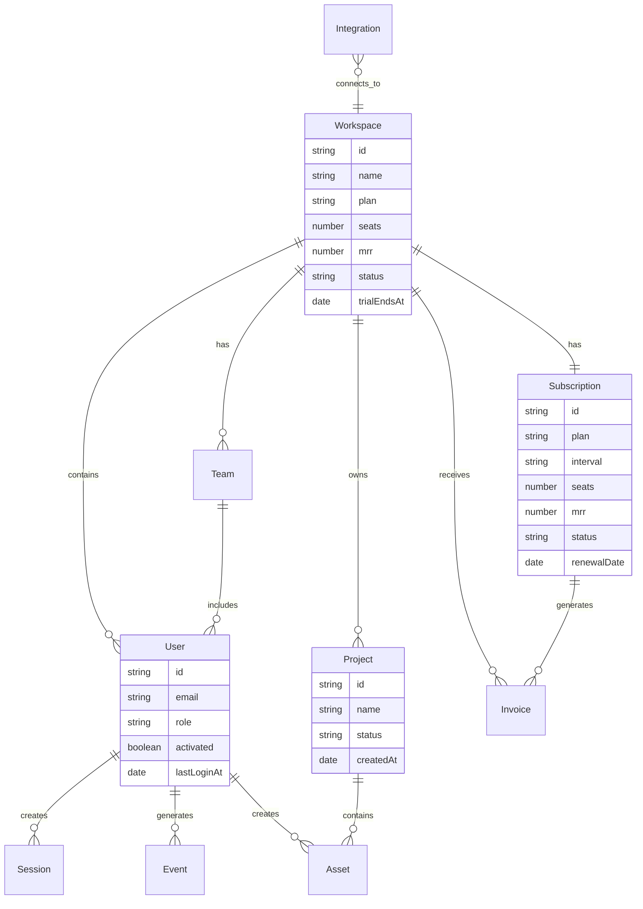
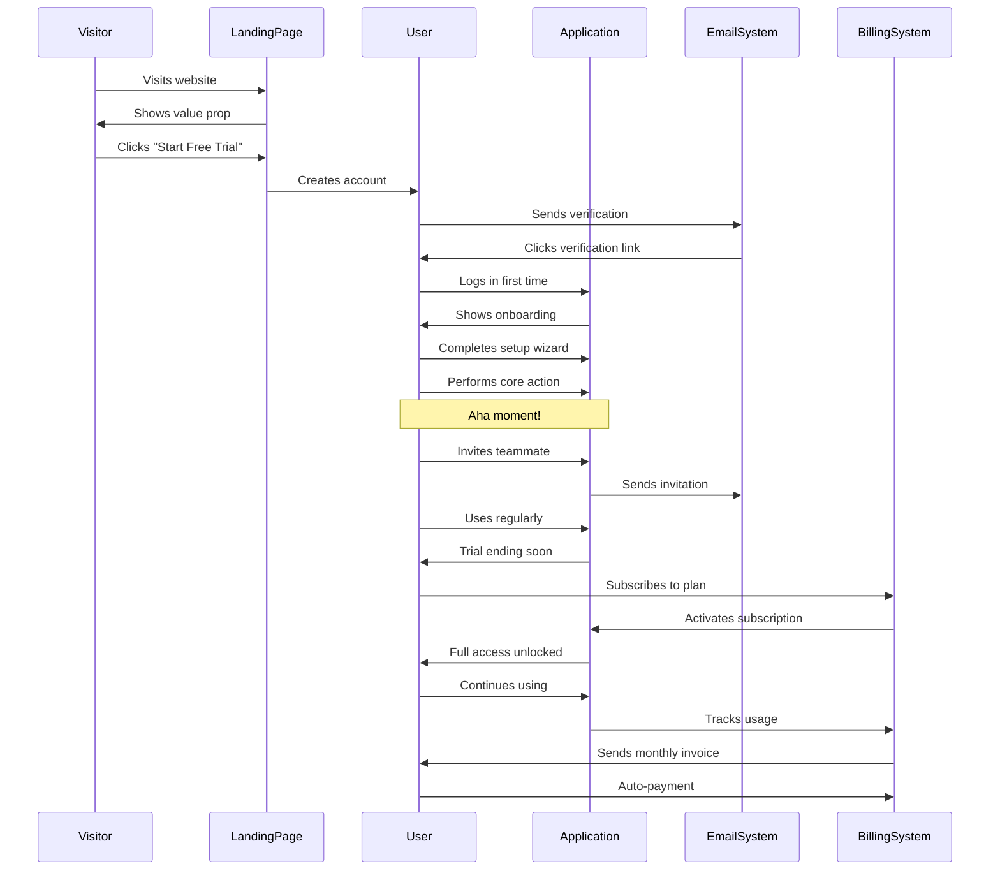
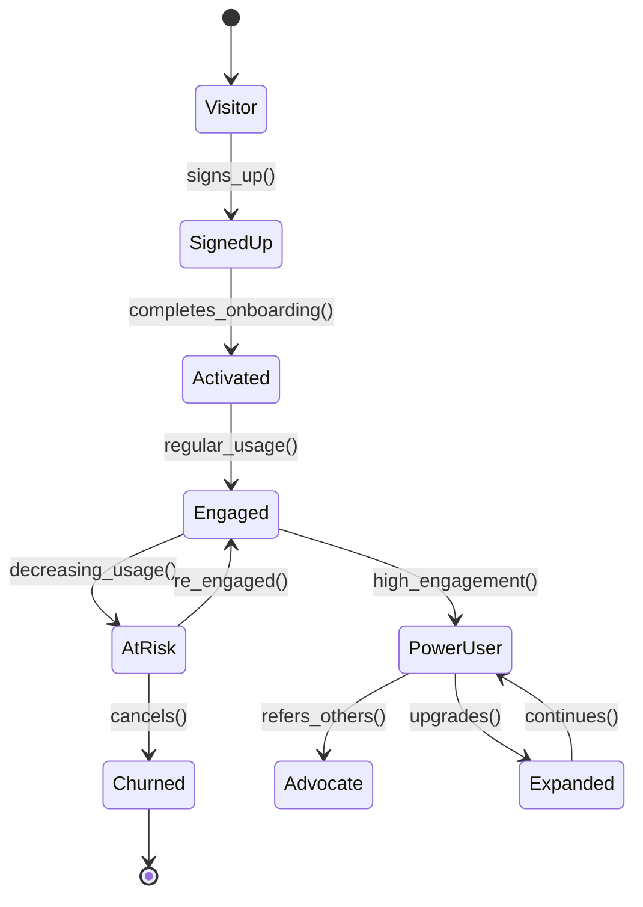
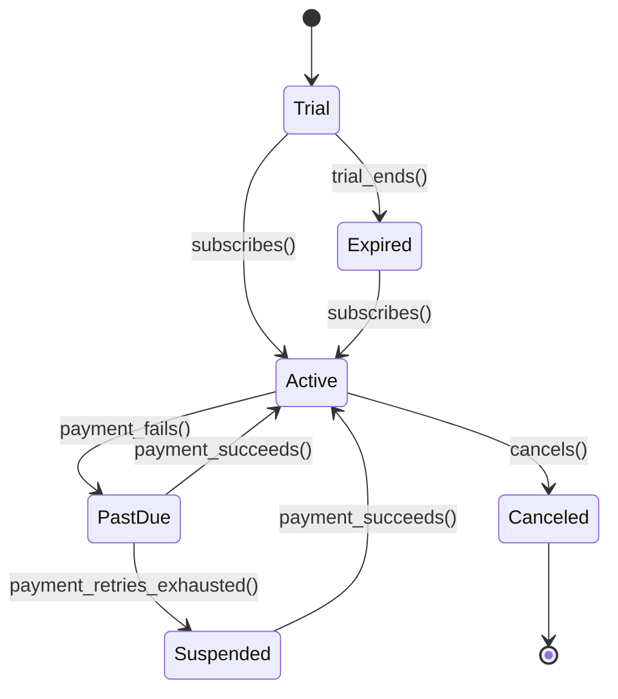
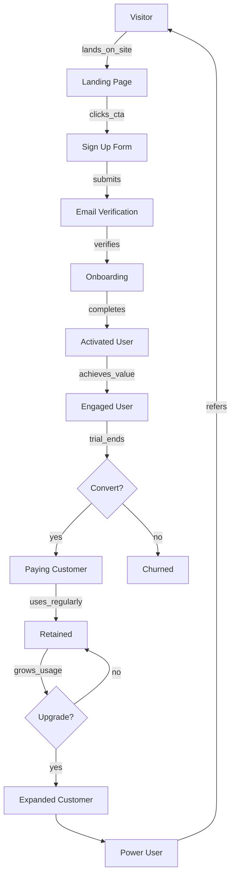
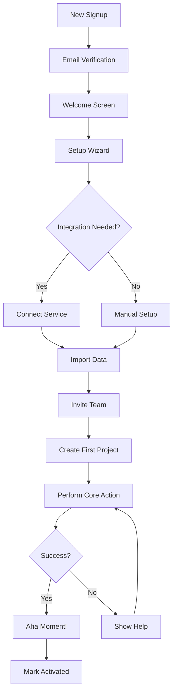
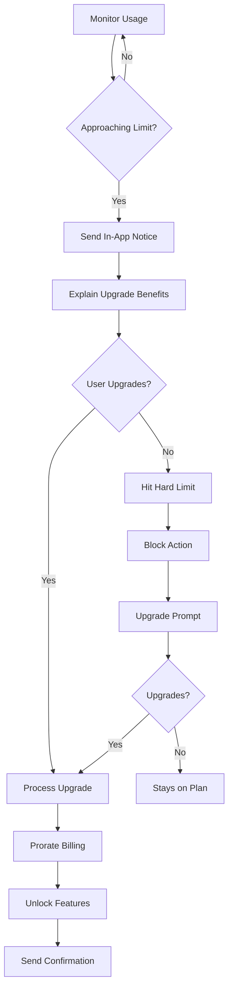
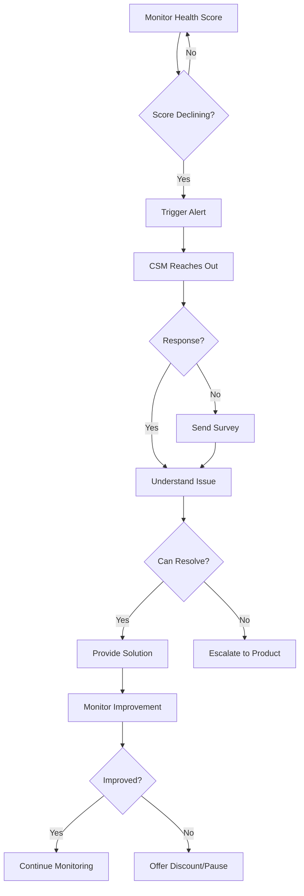

# SaaS Operational Model

## Core Abstraction

Software-as-a-Service delivers cloud-hosted applications via subscription model with continuous updates and self-service onboarding.

## GraphDL Statements

```graphdl
SaaS.isA.OnlineBusiness
SaaS.delivers.Software
SaaS.hosts.OnCloud
SaaS.charges.Subscription
SaaS.provides.ContinuousUpdate
SaaS.enables.SelfService
SaaS.offers.FreeTrial
SaaS.manages.Tenant
SaaS.ensures.DataSecurity
SaaS.provides.API
SaaS.tracks.MRR
SaaS.tracks.ARR
SaaS.tracks.Churn
SaaS.tracks.LTV
SaaS.tracks.CAC
SaaS.optimizes.Retention
SaaS.drives.Expansion
```

## Nouns (Entities)

### Core Entities

**User**
- Properties: email, name, role, permissions, workspace, createdAt, lastLoginAt
- States: invited, pending, active, inactive, churned
- Actions: signs_up, logs_in, invites_teammate, performs_action, churns

**Workspace**
- Properties: name, plan, seats, usage, billingEmail, createdAt
- States: trial, active, past_due, canceled, suspended
- Actions: created, upgraded, downgraded, suspended, reactivated

**Subscription**
- Properties: plan, interval, seats, addons, mrr, status, renewalDate
- States: trialing, active, past_due, canceled, paused
- Actions: started, upgraded, downgraded, renewed, canceled, paused

**Feature**
- Properties: name, description, plan_availability, usage_limit, enabled
- States: beta, ga, deprecated, sunset
- Actions: released, adopted, deprecated

**Session**
- Properties: userId, startTime, duration, actions, device, location
- States: active, idle, ended
- Actions: started, continued, ended

### Product Entities

**Project**
- Properties: name, owner, team, createdAt, updatedAt, status
- States: active, archived, deleted
- Actions: created, updated, shared, archived

**Team**
- Properties: name, members, role_assignments, permissions
- States: active, suspended
- Actions: created, member_added, member_removed, permissions_changed

**Integration**
- Properties: service, credentials, config, status, lastSynced
- States: connected, disconnected, errored, syncing
- Actions: connected, synced, disconnected, failed

**Asset**
- Properties: type, owner, size, createdAt, sharedWith
- States: draft, published, archived
- Actions: created, edited, shared, deleted

### Analytics Entities

**Event**
- Properties: name, userId, workspaceId, properties, timestamp
- Actions: tracked, aggregated, analyzed

**Cohort**
- Properties: name, definition, size, createdDate
- States: active, archived
- Actions: created, analyzed, compared

## Properties by Entity

### User Properties
```typescript
interface User {
  id: string
  email: string
  name: string
  avatar?: string
  role: 'owner' | 'admin' | 'member' | 'viewer'
  workspaceId: string
  permissions: string[]
  createdAt: Date
  lastLoginAt?: Date
  activatedAt?: Date
  invitedBy?: string
  onboardingCompleted: boolean
  features: string[]
}
```

### Workspace Properties
```typescript
interface Workspace {
  id: string
  name: string
  slug: string
  plan: 'free' | 'starter' | 'pro' | 'enterprise'
  billingInterval: 'monthly' | 'annual'
  seats: number
  seatsUsed: number
  mrr: number
  status: 'trial' | 'active' | 'past_due' | 'canceled'
  trialEndsAt?: Date
  subscriptionId: string
  billingEmail: string
  createdAt: Date
  features: string[]
  usage: {
    projects: number
    storage: number
    apiCalls: number
  }
  limits: {
    projects: number
    storage: number
    apiCalls: number
  }
}
```

### Subscription Properties
```typescript
interface Subscription {
  id: string
  workspaceId: string
  plan: string
  interval: 'month' | 'year'
  status: 'trialing' | 'active' | 'past_due' | 'canceled' | 'paused'
  currentPeriodStart: Date
  currentPeriodEnd: Date
  cancelAtPeriodEnd: boolean
  trialEnd?: Date
  seats: number
  unitAmount: number
  addons: Addon[]
  mrr: number
  customerId: string
  paymentMethodId: string
}
```

## Actions (Verbs)

### User Actions
- `signs_up()` - Creates account
- `verifies_email()` - Confirms email
- `completes_onboarding()` - Finishes setup
- `invites_teammate()` - Adds user
- `creates_project()` - Starts work
- `performs_core_action()` - Uses primary feature
- `integrates_service()` - Connects tool
- `upgrades_plan()` - Expands subscription
- `cancels_subscription()` - Churns
- `refers_friend()` - Advocates

### System Actions
- `provisions_workspace()` - Creates environment
- `authenticates()` - Verifies identity
- `authorizes()` - Checks permissions
- `meters_usage()` - Tracks consumption
- `enforces_limit()` - Restricts access
- `syncs_data()` - Updates information
- `sends_notification()` - Alerts user
- `generates_invoice()` - Bills customer
- `processes_payment()` - Charges card
- `sends_webhook()` - Notifies integration

## Events

### User Lifecycle Events
```
user.signed_up
user.email_verified
user.onboarding_started
user.onboarding_completed
user.activated
user.invited_teammate
user.feature_adopted
user.inactive_detected
user.churned
user.reactivated
```

### Workspace Events
```
workspace.created
workspace.trial_started
workspace.trial_ending
workspace.trial_ended
workspace.subscribed
workspace.upgraded
workspace.downgraded
workspace.canceled
workspace.suspended
workspace.reactivated
```

### Product Events
```
project.created
project.shared
feature.used
integration.connected
limit.reached
limit.exceeded
export.completed
```

### Billing Events
```
payment.succeeded
payment.failed
invoice.generated
invoice.sent
invoice.paid
subscription.renewed
subscription.canceled
refund.issued
```

## Entity Relationship Diagram



## Customer Journey Sequence



## State Diagram: User Lifecycle



## State Diagram: Workspace Status



## Funnel Flow Diagram



## Core Metrics/KPIs

### Acquisition Metrics
```
Website Visitors
Signup Rate
Trial Starts
Activation Rate (completed onboarding)
Time to Activation
CAC (Customer Acquisition Cost)
Visitor to Customer Conversion Rate
```

### Engagement Metrics
```
DAU (Daily Active Users)
WAU (Weekly Active Users)
MAU (Monthly Active Users)
DAU/MAU Ratio (stickiness)
Feature Adoption Rate
Actions per Session
Session Duration
Sessions per User
```

### Revenue Metrics
```
MRR (Monthly Recurring Revenue)
  - New MRR
  - Expansion MRR
  - Contraction MRR
  - Churn MRR
ARR (Annual Recurring Revenue)
ARPU (Average Revenue Per User)
ARPA (Average Revenue Per Account)
Customer LTV (Lifetime Value)
```

### Retention Metrics
```
Logo Churn Rate (% of customers lost)
Revenue Churn Rate (% of MRR lost)
Net Revenue Retention (NRR)
Gross Revenue Retention (GRR)
Cohort Retention (30/60/90 day)
Customer Lifespan
```

### Growth Metrics
```
MRR Growth Rate
Customer Growth Rate
Quick Ratio = (New + Expansion) / (Contraction + Churn)
LTV/CAC Ratio (target: 3+)
Months to Recover CAC
Rule of 40 = Growth Rate + Profit Margin
```

## Financial Systems

```graphdl
SaaS.uses.Stripe
SaaS.uses.Chargebee
SaaS.uses.ProfitWell
SaaS.manages.Subscription
SaaS.processes.Payment
SaaS.handles.Dunning
SaaS.calculates.MRR
SaaS.tracks.Cohort

Stripe.creates.Customer
Stripe.creates.Subscription
Stripe.charges.Payment
Stripe.handles.Webhook
Stripe.manages.Invoice
Stripe.retries.FailedPayment

Chargebee.manages.Subscription
Chargebee.handles.Upgrades
Chargebee.handles.Downgrades
Chargebee.calculates.Prorations
Chargebee.manages.Addons

ProfitWell.tracks.MRR
ProfitWell.calculates.Churn
ProfitWell.analyzes.Cohort
ProfitWell.predicts.LTV
```

### Pricing Models

**Tiered Pricing**
```
Free: $0/month
  - 1 workspace
  - 5 projects
  - Basic features

Starter: $29/month
  - 5 users
  - 50 projects
  - Standard features
  - Email support

Pro: $99/month
  - 20 users
  - Unlimited projects
  - Advanced features
  - Priority support
  - API access

Enterprise: Custom
  - Unlimited users
  - Enterprise features
  - Dedicated support
  - SLA
  - SSO
```

**Per-Seat Pricing**
```
$15/user/month (annual)
$19/user/month (monthly)
Minimum 3 seats
Volume discounts at 50, 100, 500 users
```

## Teams & Responsibilities

### Product Team
```graphdl
ProductTeam.defines.Roadmap
ProductTeam.prioritizes.Feature
ProductTeam.conducts.UserResearch
ProductTeam.analyzes.Usage
ProductTeam.runs.Experiment
ProductTeam.ships.Release

ProductTeam.employs.ProductManager
ProductTeam.employs.ProductDesigner
ProductTeam.employs.UserResearcher
ProductTeam.employs.GrowthPM
```

### Engineering Team
```graphdl
EngineeringTeam.builds.Features
EngineeringTeam.maintains.Codebase
EngineeringTeam.ensures.Performance
EngineeringTeam.fixes.Bugs
EngineeringTeam.deploys.Releases

EngineeringTeam.employs.FrontendEngineer
EngineeringTeam.employs.BackendEngineer
EngineeringTeam.employs.FullStackEngineer
EngineeringTeam.employs.DevOpsEngineer
```

### Customer Success Team
```graphdl
CSTeam.onboards.Customer
CSTeam.drives.Adoption
CSTeam.ensures.Success
CSTeam.prevents.Churn
CSTeam.identifies.Expansion

CSTeam.employs.CSM
CSTeam.employs.OnboardingSpecialist
CSTeam.employs.SupportEngineer
CSTeam.employs.SuccessOps
```

### Sales Team
```graphdl
SalesTeam.qualifies.Lead
SalesTeam.runs.Demo
SalesTeam.closes.Deal
SalesTeam.expands.Account

SalesTeam.employs.SDR
SalesTeam.employs.AE
SalesTeam.employs.SalesEngineer
SalesTeam.employs.CustomerSuccess
```

## Systems & Tools

### Product Stack
```
Frontend: React, Next.js, Vue
Backend: Node.js, Python, Go
Database: PostgreSQL, MongoDB
Cache: Redis
Queue: RabbitMQ, SQS
Search: Elasticsearch, Algolia
Storage: S3, Cloudinary
```

### Analytics Stack
```
Product Analytics: Mixpanel, Amplitude, PostHog
Session Recording: FullStory, LogRocket
Heatmaps: Hotjar
A/B Testing: Optimizely, LaunchDarkly
User Feedback: Intercom, UserVoice
Surveys: Typeform, SurveyMonkey
```

### Customer Success Stack
```
CRM: Salesforce, HubSpot
Support: Intercom, Zendesk, Front
Onboarding: Appcues, WalkMe, Pendo
Health Scoring: Gainsight, ChurnZero
Documentation: Notion, GitBook
Knowledge Base: Intercom, Zendesk
Video: Loom, Vidyard
```

### Revenue Operations Stack
```
Billing: Stripe, Chargebee
Analytics: ProfitWell, ChartMogul
Metrics: Baremetrics
Accounting: QuickBooks, Xero
Forecasting: Mosaic, Causal
Data Warehouse: Snowflake, BigQuery
BI: Metabase, Looker, Tableau
```

## Core Processes

### Onboarding Process



### Expansion Process



### Churn Prevention



## Autonomous Operations

### AI Agent Assignments

```graphdl
AIOnboardingAgent.guides.NewUser
AIOnboardingAgent.answers.Question
AIOnboardingAgent.suggests.NextStep
AIOnboardingAgent.celebrates.Milestone

AISupportAgent.answers.ProductQuestion
AISupportAgent.troubleshoots.Issue
AISupportAgent.searches.Documentation
AISupportAgent.escalates.ToHuman

AISuccessAgent.monitors.Health
AISuccessAgent.predicts.Churn
AISuccessAgent.identifies.UpgradeOpportunity
AISuccessAgent.personalizes.Communication

AIProductAgent.analyzes.Usage
AIProductAgent.identifies.Feature Gap
AIProductAgent.suggests.Improvement
AIProductAgent.prioritizes.Roadmap

AIGrowthAgent.optimizes.Funnel
AIGrowthAgent.personalizes.Onboarding
AIGrowthAgent.segments.User
AIGrowthAgent.runs.Experiment
```

## OKRs Example

### Objective: Achieve Product-Market Fit

**Key Results:**
- NPS of 50+
- Activation rate of 40%
- Month 3 retention of 70%
- 100 paying customers

### Objective: Scale Revenue

**Key Results:**
- Reach $1M ARR
- MRR growth of 20%/month
- LTV/CAC ratio of 3+
- NRR of 110%

### Objective: Reduce Churn

**Key Results:**
- Logo churn <5%/month
- Revenue churn <3%/month
- Trial-to-paid conversion 25%
- Expansion MRR = 30% of new MRR
