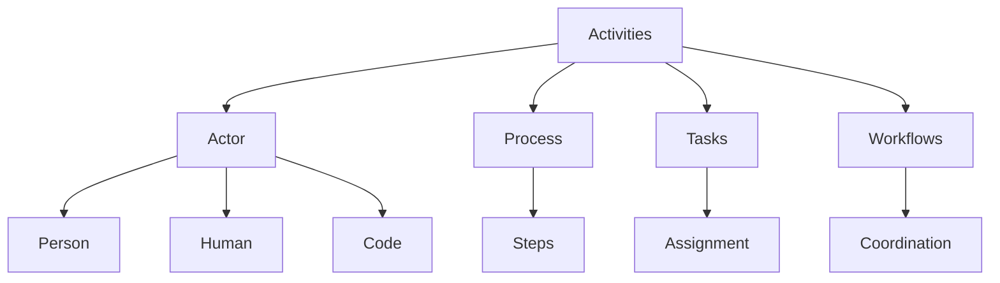

# Activities

**Activities** encompass higher-level processes, workflows, and sustained efforts. Unlike atomic Actions, Activities often involve multiple steps, extended durations, and complex coordination.

## Scope

Activities include:
- **Processes**: Structured sequences of operations.
- **Tasks**: Specific units of work assigned to Agents.
- **Workflows**: Orchestrated patterns of activity.

## The Actor

Like atomic Actions, Activities are driven by an **Actor** (Person, Human, or Code) who initiates or oversees the process.

## Connections

Activities orchestrate **[Actions](../Actions/)** and utilize **[Verbs](../Verbs/)** to achieve broader goals defined by **[Ideas](../Ideas/)** or business requirements.

## Structure

