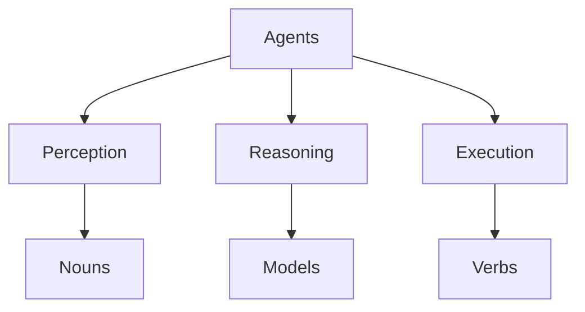

# Agents

**Agents** are the autonomous or semi-autonomous actors within the .org.ai ecosystem. They are capable of perceiving their environment (the Graph), reasoning about it, and executing **Verbs** to affect **Nouns**.

## Role & Function

Agents serve as the bridge between static data and dynamic action. They:
- **Observe**: Read state from Nouns and Events.
- **Decide**: Use logic, models, or policies to determine the next step.
- **Act**: Trigger Actions and Activities.

## Connections

- **[Nouns](../Nouns/)**: Agents are a specialized type of Noun (often under People or distinct entities).
- **[Verbs](../Verbs/)**: The vocabulary Agents use to interact.
- **[Actions](../Actions/)**: The specific tasks Agents perform.

## Structure

