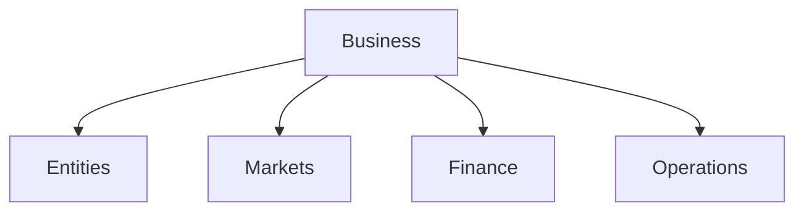

# Business

**Business** covers the economic and organizational aspects of the graph. It models the structure, operations, and financial interactions of commercial entities.

## Domains

- **Entities**: Corporations, LLCs, Non-profits, and Startups.
- **Markets**: Industries, sectors, and trade environments.
- **Finance**: Transactions, assets, liabilities, and capital.
- **Operations**: Supply chains, logistics, and management.

## Connections

Business connects:
- **[People](../People/)**: As employees, customers, and stakeholders.
- **[Products](../Things/products/)**: The goods and services exchanged.
- **[Services](../Things/products/services/)**: Intangible value provided.

## Structure

