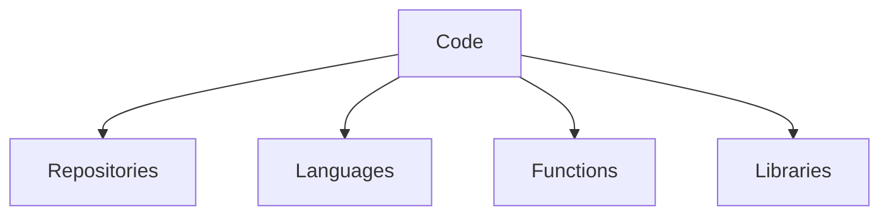

# Code

**Code** represents the executable logic, scripts, and software definitions within the graph. It bridges the gap between abstract algorithms and concrete execution by [Agents](../Agents/).

## Components

- **Repositories**: Version-controlled collections of source code.
- **Functions**: Atomic units of logic (often mapped to [Verbs](../Verbs/)).
- **Libraries**: Reusable modules and dependencies.
- **Languages**: The syntax and semantics used to express logic.

## Role

Code is the "DNA" of the digital components in the graph, defining how:
- **[Agents](../Agents/)** operate.
- **[Digital Things](../Things/)** behave.
- **[Verbs](../Verbs/)** are implemented.

## Structure

