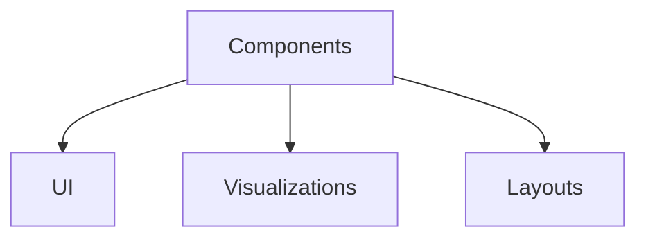

# Components

**Components** are the interactive UI elements used to render information within the graph. In MDXLD, these are JSX/React components.

## Categories

- **UI Elements**: Buttons, cards, inputs.
- **Visualizations**: Charts, graphs, diagrams.
- **Layouts**: Grids, containers, wrappers.

## Structure

