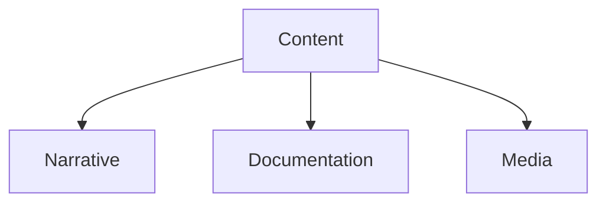

# Content

**Content** represents the narrative, textual, and media layer of the graph. In the MDXLD architecture, this is the Markdown body.

## Types

- **Narrative**: Prose and descriptions.
- **Documentation**: Guides and manuals.
- **Media References**: Links to images, video, and audio.

## Structure

