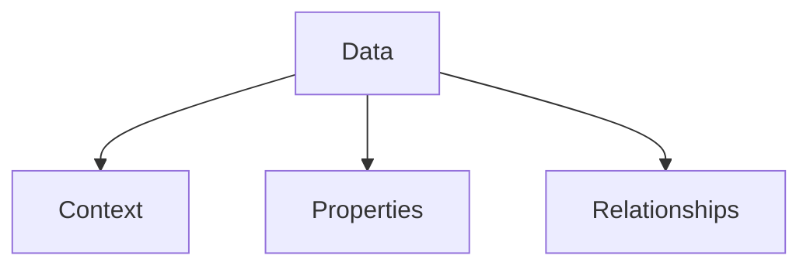

# Data

**Data** represents the structured information layer of the graph, typically expressed as YAML-LD or JSON-LD. It provides the semantic context for MDX documents.

## Role

- **Context**: Defining the schema and types.
- **Properties**: Key-value pairs describing entities.
- **Relationships**: Linking entities within the graph.

## Structure

