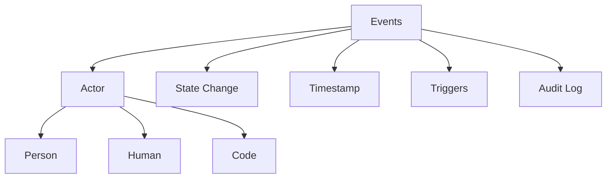

# Events

**Events** are discrete occurrences or milestones within the graph. They serve as the historical record of state changes and can act as triggers for future Actions.

## Participants

Events always record the **Actor** (Person, Human, or Code) responsible for the change, ensuring accountability and traceability.

## Characteristics

- **Immutable**: Once recorded, an Event cannot be changed.
- **Temporal**: All events are anchored in time.
- **Causal**: Events are often the result of Actions and the cause of Reactions (Triggers).

## Usage

Events are used for:
- **Audit Logs**: Tracking what happened.
- **Event-Driven Architecture**: Triggering [Agents](../Agents/) to perform new [Actions](../Actions/).
- **State History**: Reconstructing the past states of [Nouns](../Nouns/).

## Structure

