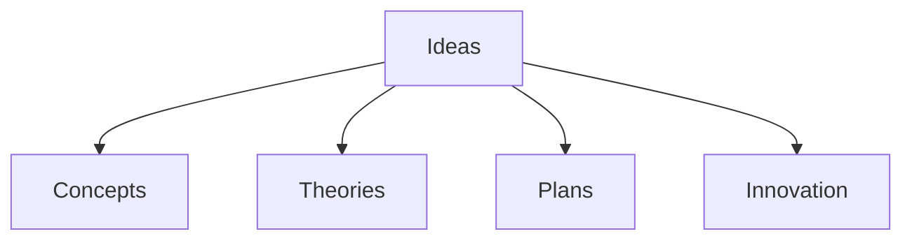

# Ideas

**Ideas** represent the intangible concepts, theories, and plans that drive innovation and structure within the graph. They are the "Why" and "How" behind the "What".

## Categories

- **Concepts**: Abstract notions or general ideas.
- **Theories**: Systematized structures of ideas explaining phenomena.
- **Plans**: Proposed sets of actions to achieve a goal.
- **Intellectual Property**: Copyrights, patents, and trade secrets.

## Role in Graph

Ideas act as blueprints for [Things](../Things/) and motivations for [Agents](../Agents/) to perform [Actions](../Actions/).

## Structure

