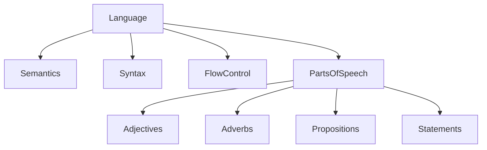

# Language

**Language** serves as the overarching framework for communication, semantics, and expression within the .org.ai graph. It underpins how all other elements — Code, Content, Data, Nouns, Verbs, and Things — are understood and articulated.

## Core Concepts

Language is composed of fundamental building blocks that enable meaning and structure:

-   **[Semantics](semantics/)**: The study of meaning in language, crucial for understanding entities and relationships.
-   **Syntax**: The rules governing sentence structure and grammar (currently represented by various markdown and code formats).
-   **Flow Control**: Mechanisms for directing logical progression and conditional execution (e.g., if, else, do, while, forEach).

## Parts of Speech & Constructs

To articulate the graph's relationships and dynamics, Language includes:

-   **[Adjectives](adjectives.md)**: Describing qualities of Nouns.
-   **[Adverbs](adverbs.md)**: Modifying Verbs, Adjectives, or other Adverbs.
-   **[Propositions](propositions.md)**: Statements that can be true or false, forming logical assertions.
-   **[Statements](statements.md)**: Declarative sentences or expressions.

## Structure

