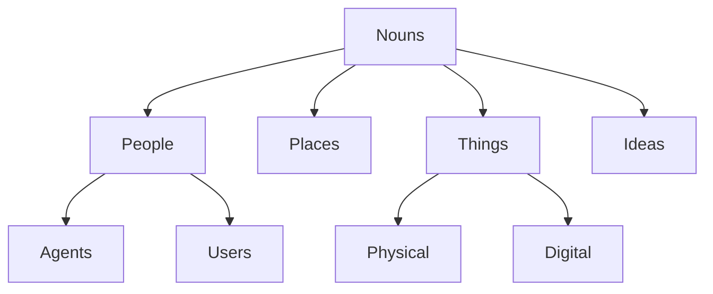

# Nouns

The **Noun** class represents the fundamental entities within the graph—the "Who" and "What". As a direct subclass of the root Type/Class, Nouns serve as the base for all tangible and intangible objects, beings, and concepts.

## Core Categories

Nouns are broadly classified into four primary domains:

- **[People](../People/)**: Individuals, groups, and organizations ("Who").
- **[Places](../Places/)**: Physical and virtual locations ("Where").
- **[Things](../Things/)**: Objects, tools, and artifacts ("What").
- **[Ideas](../Ideas/)**: Concepts, theories, and abstractions ("Why/How").

## Structure

