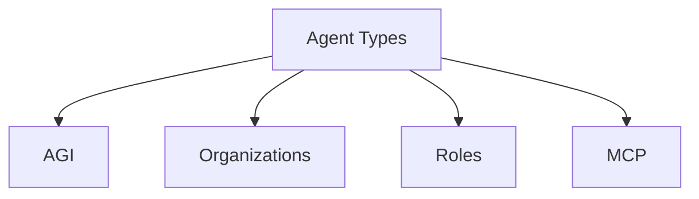

# Agent Types

This directory defines the taxonomy of **Agents** as Nouns. While the top-level **[Agents](../../Agents/)** directory focuses on the functional aspect of agents (observation, reasoning, action), this section categorizes the *types* of agents that exist.

## Categories

- **[AGI](agi/)**: Artificial General Intelligence concepts.
- **[Organizations](organizations/)**: Corporate or collective agents.
- **[People](people/)**: Human agents (referenced).
- **[Roles](roles/)**: Defined functions an agent plays.
- **[MCP](mcp/)**: Model Context Protocol agents.

## Structure

