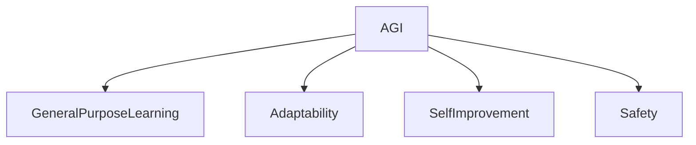

# Artificial General Intelligence (AGI)

**Artificial General Intelligence (AGI)** represents a hypothetical type of intelligent agent capable of understanding, learning, and applying intelligence across a wide range of tasks, similar to human cognitive abilities. Unlike narrow AI, which excels at specific tasks, AGI aims for versatile and adaptable intelligence.

## Core Characteristics

-   **General Purpose Learning**: Ability to learn any intellectual task that a human being can.
-   **Adaptability**: Capable of adapting to new environments and problems without explicit retraining.
-   **Self-Improvement**: Potential to recursively enhance its own capabilities.

## Connections

-   **[Agents](../../../Agents/)**: AGI is the ultimate form of an Agent.
-   **[Safety](safety/)**: A critical sub-domain focusing on ensuring beneficial and controlled AGI development.
-   **[Roles](../../roles/)**: AGI could fulfill multiple roles within the graph.

## Structure

