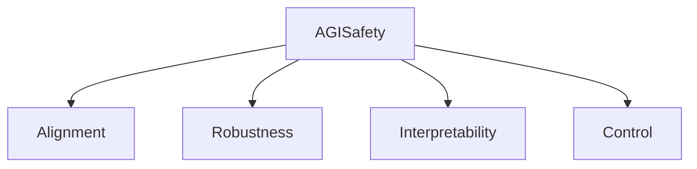

# AGI Safety

**AGI Safety** is a crucial sub-domain dedicated to ensuring that Artificial General Intelligence systems are developed and deployed in a manner that is beneficial, robust, and aligned with human values. It addresses the potential risks and challenges associated with highly capable AI.

## Core Concerns

-   **Alignment**: Ensuring AGI's goals and motivations are aligned with human welfare.
-   **Robustness**: Preventing unintended behaviors and failures in complex environments.
-   **Interpretability**: Understanding how AGI systems make decisions.
-   **Control**: Developing mechanisms to maintain human oversight and intervention.

## Connections

-   **[AGI](../README.md)**: The primary subject of safety research.
-   **[Ethics](../../../ideas/ethics.md)**: Strong overlap with ethical considerations in AI.

## Structure

