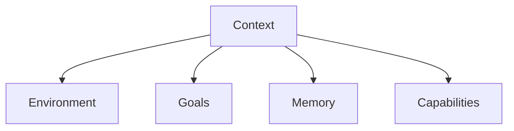

# Agent Context

**Agent Context** refers to the relevant information, environment, and state that an agent is aware of and utilizes to perform its tasks. It's crucial for enabling intelligent decision-making and interaction within the graph.

## Elements of Context

-   **Environment**: The current state of [Nouns](../../../Nouns/) and [Things](../../../Things/) relevant to the agent.
-   **Goals**: The objectives or [Ideas](../../../Ideas/) the agent is trying to achieve.
-   **Memory**: Past [Events](../../../Events/) and learned information.
-   **Capabilities**: The [Verbs](../../../Verbs/) and [Actions](../../../Actions/) an agent can perform.

## Connections

Context is foundational for how an **[Agent](../../../Agents/)** interacts with the broader **[Graph](/)**.

## Structure

