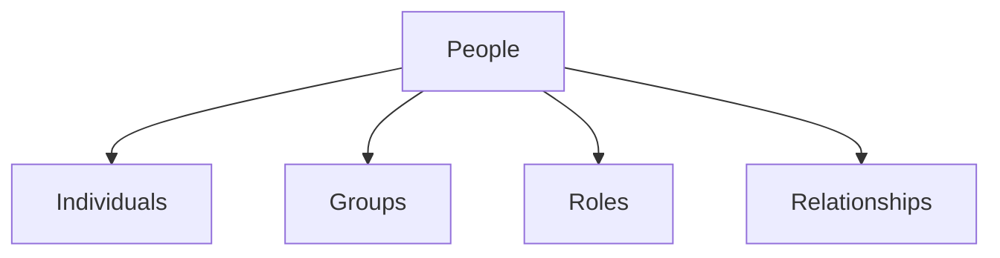

# People

**People** represent the human element within the graph. This class covers individuals, social groups, and the complex web of relationships that connect them.

## Scope

- **Individuals**: Distinct human beings.
- **Groups**: Informal collections of people (families, teams).
- **Roles**: The functions people perform (e.g., Employee, Parent).

## Connections

People are the primary:
- **Creators** of [Ideas](../Ideas/).
- **Users** of [Things](../Things/).
- **Occupants** of [Places](../Places/).

## Structure

