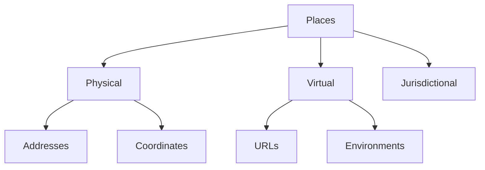

# Places

**Places** define the "Where" of the graph. They encompass all physical locations, geographical regions, and increasingly, virtual spaces.

## Dimensions

- **Physical**: Geocoordinates, addresses, buildings, and rooms.
- **Virtual**: URLs, servers, digital environments, and cloud regions.
- **Jurisdictional**: Countries, states, and legal territories.

## Interactions

Places provide the context for:
- **[Events](../Events/)**: Where things happen.
- **[People](../People/)**: Where they live and work.
- **[Things](../Things/)**: Where items are stored or deployed.

## Structure

