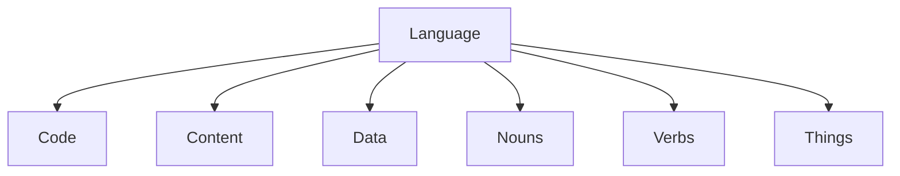
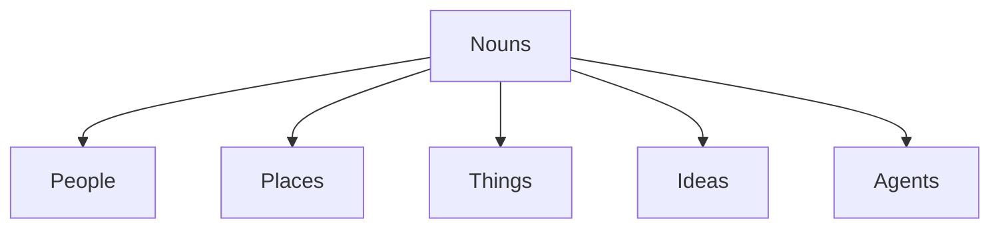
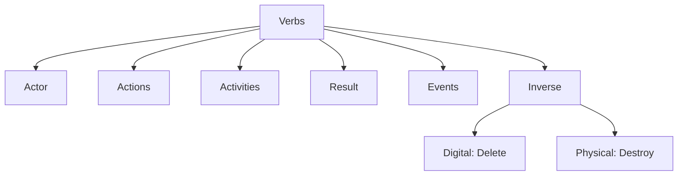

# .org.ai Graph & Ontology

The meta-graph definition and core ontology for the .org.ai ecosystem.

## Overview

At the foundation of the .org.ai Graph & Ontology is **[Language](Language/)**, which provides the overarching framework for the graph's core elements: **[Code](Code/)**, **[Content](Content/)**, **[Data](Data/)**, **[Nouns](Nouns/)**, **[Verbs](Verbs/)**, and **[Things](Things/)**.

### [Nouns](Nouns/)
Nouns represent the entities in our graph, categorized primarily into:
- **[People](People/)**
- **[Places](Places/)**
- **[Things](Things/)**
- **[Ideas](Ideas/)**
- **[Agents](Agents/)**

### [Verbs](Verbs/)
Verbs drive the dynamics of the system. They are intrinsically connected to:
- **Actors** (Creator)
- **[Actions](Actions/)** (Create)
- **[Activities](Activities/)** (Creating)
- **Results** (Creation)
- **[Events](Events/)** (Created)
- **Inverse Operations** (Digital: delete, Physical: destroy)

### Core Elements
- **[Code](Code/)**: The executable logic and software definitions.
- **[Content](Content/)**: The narrative and textual body of information.
- **[Data](Data/)**: Structured information and semantic context.

## Diagrams

### Core Foundation
The high-level structure of the graph.

### Noun Taxonomy
How entities are categorized.

### Verb Dynamics
The lifecycle and relationships of actions.

