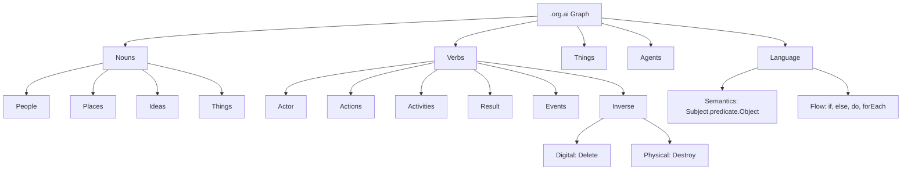

# .org.ai Graph & Ontology

The meta-graph definition and core ontology for the .org.ai ecosystem.

## Overview

At the foundation of the .org.ai Graph & Ontology are **[Nouns](Nouns/)**, **[Verbs](Verbs/)**, and **[Things](Things/)**.

### [Nouns](Nouns/)
Nouns represent the entities in our graph, categorized primarily into:
- **[People](People/)**
- **[Places](Places/)**
- **[Things](Things/)**
- **[Ideas](Ideas/)**

### [Verbs](Verbs/)
Verbs drive the dynamics of the system. They are intrinsically connected to:
- **Actors** (Creator)
- **[Actions](Actions/)** (Create)
- **[Activities](Activities/)** (Creating)
- **Results** (Creation)
- **[Events](Events/)** (Created)
- **Inverse Operations** (Digital: delete, Physical: destroy)

### Language & Flow
The ontology encompasses language structures, including all parts of speech, semantics (Subject.predicate.Object), and logical flow controls (if, else, do, while, until, forEach). Language concepts are primarily located within **[Things/language](Things/language/)**.

### [Agents](Agents/)
[Agents](Agents/) operate within this superset to facilitate interaction, automation, and reasoning across the graph.

## Ontology Diagram

