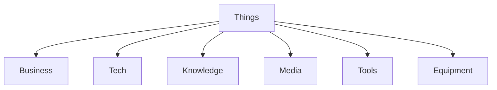

# Things

**Things** encompass the vast array of inanimate objects, tools, artifacts, and specialized domains within the graph. This category covers everything from physical equipment to abstract knowledge bases.

## Key Categories

- **[Business](business/)**: Companies, industries, and economic entities.
- **[Tech](tech/)**: Technology stacks, APIs, models, and security.
- **[Knowledge](knowledge/)**: Data sets, education, laws, and standards.
- **[Media](media/)**: Content, images, video, and reports.
- **[Tools](tools/)**: Utility instruments and vehicles.
- **[Equipment](equipment/)**: Hardware and machinery.

## Structure

