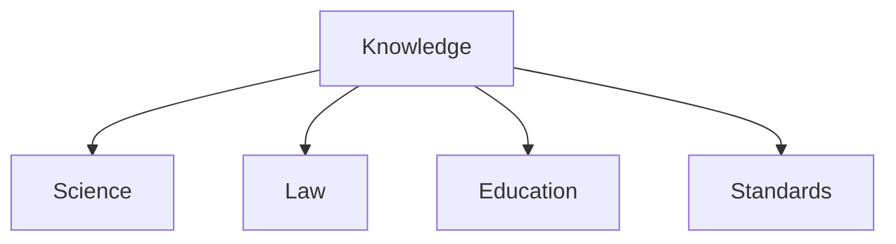

# Knowledge

**Knowledge** encompasses structured information, standards, and educational resources. It is the "brain" of the graph, storing facts and methodologies.

## Domains

- **[Science](science/)**: Formal sciences, health, and research.
- **[Law](law/)**: Legal frameworks, contracts, and regulations.
- **[Education](education/)**: Learning resources and courses.
- **[Standards](standards/)**: Industry standards (GS1, NAICS, ONET).
- **[Wiki](wiki/)**: General knowledge bases.

## Structure

