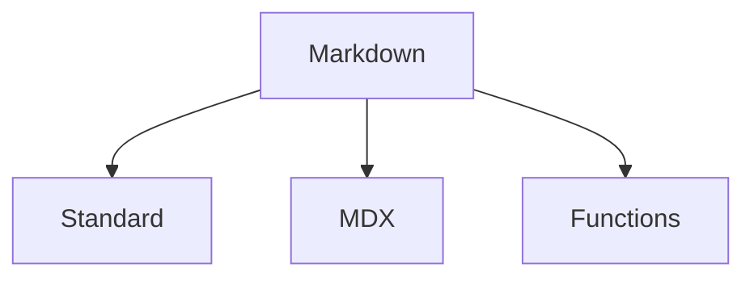

# Markdown

**Markdown** is the primary format for textual content within the graph, serving as the base for documentation and structured data integration.

## Formats

- **[Standard](standard/)**: CommonMark/GFM specifications.
- **[MDX](mdx/)**: Extended Markdown with JSX and Data support.
- **[Functions](functions/)**: Markdown usage in functional contexts.

## Structure

