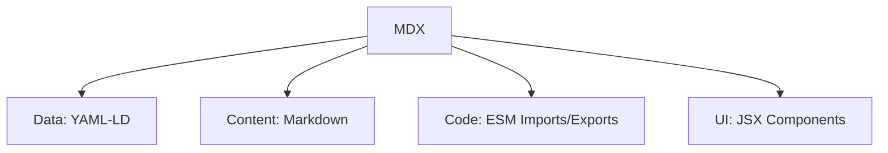

# MDX

**MDX** is a powerful format that blends data, content, logic, and presentation into a single file. In the .org.ai graph, MDX is treated as a composite entity.

## Composition

MDX is defined as the intersection of four distinct layers:

1.  **Data (YAML-LD)**: Structured data embedded in the frontmatter, providing semantic context (Linked Data).
2.  **Content (Markdown)**: The narrative or textual body of the document.
3.  **Code (ES Module Imports/Exports)**: JavaScript/TypeScript logic for data fetching, state management, or utilities.
4.  **UI Components (JSX)**: Interactive elements rendered within the content flow.

## Formula

$$
MDX = Data_{(YAML-LD)} + Content_{(Markdown)} + Code_{(ESM)} + UI_{(JSX)}
$$

## Structure

