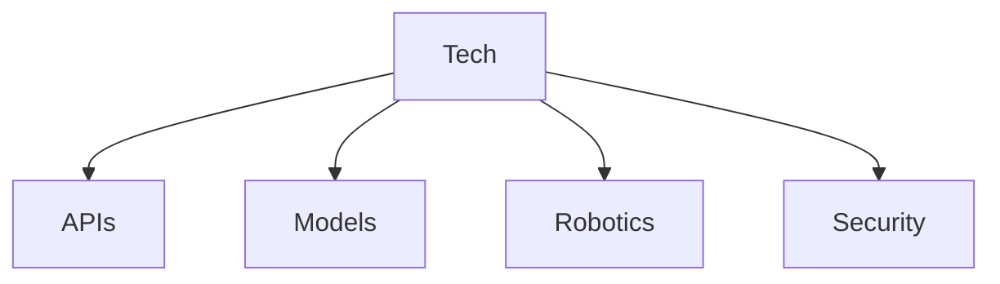

# Technology

**Technology** represents the tools, frameworks, and systems that enable digital and physical operations.

## Core Pillars

- **[APIs](apis/)**: Interfaces for software interaction.
- **[Code](code/)**: Source code and scripts (linked to [Code](../../Code/)).
- **[Models](models/)**: AI and statistical models.
- **[Robotics](robotics/)**: Hardware automation.
- **[Security](security/)**: Protection and encryption protocols.

## Structure

