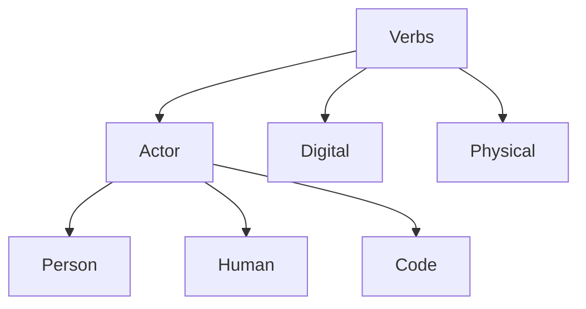

# Verbs

**Verbs** define the actions, operations, and transitions within the graph. They represent the dynamic "How" of the system, driving changes in state and facilitating interactions between Nouns.

## The Actor

In any Verb execution (as well as in [Actions](../Actions/), [Activities](../Activities/), and [Events](../Events/)), the entity initiating the process is the **Actor**.

An **Actor** can be:
- **Person**: A specific individual identity.
- **Human**: A biological human (often used in general contexts).
- **Code**: Automated logic, bots, or AI agents.

## Operational Domains

Verbs are categorized into two primary domains: **Digital** (virtual/computational) and **Physical** (material/logistical).

### Digital Verbs

Operations occurring within the digital or virtual realm.

| Action                                   | Actor                                                 | Act                             | Activity                                        | Result                                      | Event                                     | Inverse                        | Description              | Same As                                                          |
| :--------------------------------------- | :---------------------------------------------------- | :------------------------------ | :---------------------------------------------- | :------------------------------------------ | :---------------------------------------- | :----------------------------- | :----------------------- | :--------------------------------------------------------------- |
| [Achieve](../Actions/achieve.md)         | [Achiever](../Nouns/agents/roles/achiever.md)         | [achieves](achieves.md)         | [Achieving](../Activities/achieving.md)         | [Achievement](../Things/achievement.md)     | [Achieved](../Events/achieved.md)         | [Fail](fails.md)               | Reaching a goal.         | [schema:AchieveAction](https://schema.org/AchieveAction)         |
| [Assess](../Actions/assess.md)           | [Assessor](../Nouns/agents/roles/assessor.md)         | [assesses](assesses.md)         | [Assessing](../Activities/assessing.md)         | [Assessment](../Things/assessment.md)       | [Assessed](../Events/assessed.md)         | [Ignore](ignores.md)           | Evaluating state.        | [schema:AssessAction](https://schema.org/AssessAction)           |
| [Communicate](../Actions/communicate.md) | [Communicator](../Nouns/agents/roles/communicator.md) | [communicates](communicates.md) | [Communicating](../Activities/communicating.md) | [Communication](../Things/communication.md) | [Communicated](../Events/communicated.md) | [Silence](silences.md)         | Transmitting info.       | [schema:CommunicateAction](https://schema.org/CommunicateAction) |
| [Create](../Actions/create.md)           | [Creator](../Nouns/agents/roles/creator.md)           | [creates](creates.md)           | [Creating](../Activities/creating.md)           | [Creation](../Things/creation.md)           | [Created](../Events/created.md)           | [Delete](deletes.md)           | Bringing into existence. | [schema:CreateAction](https://schema.org/CreateAction)           |
| [Discover](../Actions/discover.md)       | [Discoverer](../Nouns/agents/roles/discoverer.md)     | [discovers](discovers.md)       | [Discovering](../Activities/discovering.md)     | [Discovery](../Things/discovery.md)         | [Discovered](../Events/discovered.md)     | [Lose](loses.md)               | Finding info.            | [schema:DiscoverAction](https://schema.org/DiscoverAction)       |
| [Interact](../Actions/interact.md)       | [Interactor](../Nouns/agents/roles/interactor.md)     | [interacts](interacts.md)       | [Interacting](../Activities/interacting.md)     | [Interaction](../Things/interaction.md)     | [Interacted](../Events/interacted.md)     | [Disengage](disengages.md)     | Engaging with interface. | [schema:InteractAction](https://schema.org/InteractAction)       |
| [Listen](../Actions/listen.md)           | [Listener](../Nouns/agents/roles/listener.md)         | [listens](listens.md)           | [Listening](../Activities/listening.md)         | [Listen](../Things/listen.md)               | [Listened](../Events/listened.md)         | [Ignore](ignores.md)           | Receiving audio.         | [schema:ListenAction](https://schema.org/ListenAction)           |
| [Organize](../Actions/organize.md)       | [Organizer](../Nouns/agents/roles/organizer.md)       | [organizes](organizes.md)       | [Organizing](../Activities/organizing.md)       | [Organization](../Things/organization.md)   | [Organized](../Events/organized.md)       | [Disorganize](disorganizes.md) | Structuring data.        | [schema:OrganizeAction](https://schema.org/OrganizeAction)       |
| [Plan](../Actions/plan.md)               | [Planner](../Nouns/agents/roles/planner.md)           | [plans](plans.md)               | [Planning](../Activities/planning.md)           | [Plan](../Things/plan.md)                   | [Planned](../Events/planned.md)           | [Cancel](cancels.md)           | Designing actions.       | [schema:PlanAction](https://schema.org/PlanAction)               |
| [Play](../Actions/play.md)               | [Player](../Nouns/agents/roles/player.md)             | [plays](plays.md)               | [Playing](../Activities/playing.md)             | [Play](../Things/play.md)                   | [Played](../Events/played.md)             | [Stop](stops.md)               | Media/Game simulation.   | [schema:PlayAction](https://schema.org/PlayAction)               |
| [Read](../Actions/read.md)               | [Reader](../Nouns/agents/roles/reader.md)             | [reads](reads.md)               | [Reading](../Activities/reading.md)             | [Read](../Things/read.md)                   | [Read](../Events/read.md)                 | [Write](writes.md)             | Consuming text.          | [schema:ReadAction](https://schema.org/ReadAction)               |
| [Search](../Actions/search.md)           | [Searcher](../Nouns/agents/roles/searcher.md)         | [searches](searches.md)         | [Searching](../Activities/searching.md)         | [Search](../Things/search.md)               | [Searched](../Events/searched.md)         | [Find](finds.md)               | Querying info.           | [schema:SearchAction](https://schema.org/SearchAction)           |
| [Trade](../Actions/trade.md)             | [Trader](../Nouns/agents/roles/trader.md)             | [trades](trades.md)             | [Trading](../Activities/trading.md)             | [Trade](../Things/trade.md)                 | [Traded](../Events/traded.md)             | [Keep](keeps.md)               | Exchanging assets.       | [schema:TradeAction](https://schema.org/TradeAction)             |
| [Transfer](../Actions/transfer.md)       | [Transferer](../Nouns/agents/roles/transferer.md)     | [transfers](transfers.md)       | [Transferring](../Activities/transferring.md)   | [Transfer](../Things/transfer.md)           | [Transferred](../Events/transferred.md)   | [Retain](retains.md)           | Moving data.             | [schema:TransferAction](https://schema.org/TransferAction)       |
| [Update](../Actions/update.md)           | [Updater](../Nouns/agents/roles/updater.md)           | [updates](updates.md)           | [Updating](../Activities/updating.md)           | [Update](../Things/update.md)               | [Updated](../Events/updated.md)           | [Revert](reverts.md)           | Modifying entity.        | [schema:UpdateAction](https://schema.org/UpdateAction)           |
| [View](../Actions/view.md)               | [Viewer](../Nouns/agents/roles/viewer.md)             | [views](views.md)               | [Viewing](../Activities/viewing.md)             | [View](../Things/view.md)                   | [Viewed](../Events/viewed.md)             | [Close](closes.md)             | Visual inspection.       | [schema:ViewAction](https://schema.org/ViewAction)               |
| [Watch](../Actions/watch.md)             | [Watcher](../Nouns/agents/roles/watcher.md)           | [watches](watches.md)           | [Watching](../Activities/watching.md)           | [Watch](../Things/watch.md)                 | [Watched](../Events/watched.md)           | [Ignore](ignores.md)           | Observing visual.        | [schema:WatchAction](https://schema.org/WatchAction)             |

### Physical Verbs

Operations involving physical entities, logistics, or hardware.

| Action                                     | Actor                                                     | Act                               | Activity                                            | Result                                        | Event                                         | Inverse                          | Description               | Same As                                                        |
| :----------------------------------------- | :-------------------------------------------------------- | :-------------------------------- | :-------------------------------------------------- | :-------------------------------------------- | :-------------------------------------------- | :------------------------------- | :------------------------ | :------------------------------------------------------------- |
| [Commission](../Actions/commission.md)     | [Commissioner](../Nouns/agents/roles/commissioner.md)     | [commissions](commissions.md)     | [Commissioning](../Activities/commissioning.md)     | [Commission](../Things/commission.md)         | [Commissioned](../Events/commissioned.md)     | [Decommission](decommissions.md) | Authorizing equipment.    | [gs1:commissioning](https://www.gs1.org/voc/commissioning)     |
| [Decommission](../Actions/decommission.md) | [Decommissioner](../Nouns/agents/roles/decommissioner.md) | [decommissions](decommissions.md) | [Decommissioning](../Activities/decommissioning.md) | [Decommission](../Things/decommission.md)     | [Decommissioned](../Events/decommissioned.md) | [Commission](commissions.md)     | Removing service.         | [gs1:decommissioning](https://www.gs1.org/voc/decommissioning) |
| [Destroy](../Actions/destroy.md)           | [Destroyer](../Nouns/agents/roles/destroyer.md)           | [destroys](destroys.md)           | [Destroying](../Activities/destroying.md)           | [Destruction](../Things/destruction.md)       | [Destroyed](../Events/destroyed.md)           | [Create](creates.md)             | Irreversible ending.      | [gs1:destroying](https://www.gs1.org/voc/destroying)           |
| [Encode](../Actions/encode.md)             | [Encoder](../Nouns/agents/roles/encoder.md)               | [encodes](encodes.md)             | [Encoding](../Activities/encoding.md)               | [Encode](../Things/encode.md)                 | [Encoded](../Events/encoded.md)               | [Decode](decodes.md)             | Formatting info.          | [gs1:encoding](https://www.gs1.org/voc/encoding)               |
| [Export](../Actions/export.md)             | [Exporter](../Nouns/agents/roles/exporter.md)             | [exports](exports.md)             | [Exporting](../Activities/exporting.md)             | [Export](../Things/export.md)                 | [Exported](../Events/exported.md)             | [Import](imports.md)             | Sending out.              | [gs1:exporting](https://www.gs1.org/voc/exporting)             |
| [Hold](../Actions/hold.md)                 | [Holder](../Nouns/agents/roles/holder.md)                 | [holds](holds.md)                 | [Holding](../Activities/holding.md)                 | [Hold](../Things/hold.md)                     | [Held](../Events/held.md)                     | [Release](releases.md)           | Possessing object.        | [gs1:holding](https://www.gs1.org/voc/holding)                 |
| [Inspect](../Actions/inspect.md)           | [Inspector](../Nouns/agents/roles/inspector.md)           | [inspects](inspects.md)           | [Inspecting](../Activities/inspecting.md)           | [Inspection](../Things/inspection.md)         | [Inspected](../Events/inspected.md)           | [Ignore](ignores.md)             | Examining quality.        | [gs1:inspecting](https://www.gs1.org/voc/inspecting)           |
| [Install](../Actions/install.md)           | [Installer](../Nouns/agents/roles/installer.md)           | [installs](installs.md)           | [Installing](../Activities/installing.md)           | [Install](../Things/install.md)               | [Installed](../Events/installed.md)           | [Uninstall](uninstalls.md)       | Setting up hardware.      | [gs1:installing](https://www.gs1.org/voc/installing)           |
| [Kill](../Actions/kill.md)                 | [Killer](../Nouns/agents/roles/killer.md)                 | [kills](kills.md)                 | [Killing](../Activities/killing.md)                 | [Kill](../Things/kill.md)                     | [Killed](../Events/killed.md)                 | [Revive](revives.md)             | Terminating life/process. | [schema:DeleteAction](https://schema.org/DeleteAction)         |
| [Load](../Actions/load.md)                 | [Loader](../Nouns/agents/roles/loader.md)                 | [loads](loads.md)                 | [Loading](../Activities/loading.md)                 | [Load](../Things/load.md)                     | [Loaded](../Events/loaded.md)                 | [Unload](unloads.md)             | Placing cargo.            | [gs1:loading](https://www.gs1.org/voc/loading)                 |
| [Pack](../Actions/pack.md)                 | [Packer](../Nouns/agents/roles/packer.md)                 | [packs](packs.md)                 | [Packing](../Activities/packing.md)                 | [Pack](../Things/pack.md)                     | [Packed](../Events/packed.md)                 | [Unpack](unpacks.md)             | Preparing for ship.       | [gs1:packing](https://www.gs1.org/voc/packing)                 |
| [Pick](../Actions/pick.md)                 | [Picker](../Nouns/agents/roles/picker.md)                 | [picks](picks.md)                 | [Picking](../Activities/picking.md)                 | [Pick](../Things/pick.md)                     | [Picked](../Events/picked.md)                 | [Place](places.md)               | Selecting items.          | [gs1:picking](https://www.gs1.org/voc/picking)                 |
| [Receive](../Actions/receive.md)           | [Receiver](../Nouns/agents/roles/receiver.md)             | [receives](receives.md)           | [Receiving](../Activities/receiving.md)             | [Receipt](../Things/receipt.md)               | [Received](../Events/received.md)             | [Reject](rejects.md)             | Accepting goods.          | [gs1:receiving](https://www.gs1.org/voc/receiving)             |
| [Remove](../Actions/remove.md)             | [Remover](../Nouns/agents/roles/remover.md)               | [removes](removes.md)             | [Removing](../Activities/removing.md)               | [Removal](../Things/removal.md)               | [Removed](../Events/removed.md)               | [Add](adds.md)                   | Taking away.              | [gs1:removing](https://www.gs1.org/voc/removing)               |
| [Repair](../Actions/repair.md)             | [Repairer](../Nouns/agents/roles/repairer.md)             | [repairs](repairs.md)             | [Repairing](../Activities/repairing.md)             | [Repair](../Things/repair.md)                 | [Repaired](../Events/repaired.md)             | [Break](breaks.md)               | Restoring condition.      | [schema:RepairAction](https://schema.org/RepairAction)         |
| [Sell](../Actions/sell.md)                 | [Seller](../Nouns/agents/roles/seller.md)                 | [sells](sells.md)                 | [Selling](../Activities/selling.md)                 | [Sale](../Things/sale.md)                     | [Sold](../Events/sold.md)                     | [Buy](buys.md)                   | Exchanging for value.     | [schema:SellAction](https://schema.org/SellAction)             |
| [Ship](../Actions/ship.md)                 | [Shipper](../Nouns/agents/roles/shipper.md)               | [ships](ships.md)                 | [Shipping](../Activities/shipping.md)               | [Shipment](../Things/shipment.md)             | [Shipped](../Events/shipped.md)               | [Receive](receives.md)           | Transporting goods.       | [gs1:shipping](https://www.gs1.org/voc/shipping)               |
| [Stock](../Actions/stock.md)               | [Stocker](../Nouns/agents/roles/stocker.md)               | [stocks](stocks.md)               | [Stocking](../Activities/stocking.md)               | [Stock](../Things/stock.md)                   | [Stocked](../Events/stocked.md)               | [Deplete](depletes.md)           | Replenishing.             | [gs1:stocking](https://www.gs1.org/voc/stocking)               |
| [Store](../Actions/store.md)               | [Storer](../Nouns/agents/roles/storer.md)                 | [stores](stores.md)               | [Storing](../Activities/storing.md)                 | [Store](../Things/store.md)                   | [Stored](../Events/stored.md)                 | [Retrieve](retrieves.md)         | Keeping objects.          | [gs1:storing](https://www.gs1.org/voc/storing)                 |
| [Transform](../Actions/transform.md)       | [Transformer](../Nouns/agents/roles/transformer.md)       | [transforms](transforms.md)       | [Transforming](../Activities/transforming.md)       | [Transformation](../Things/transformation.md) | [Transformed](../Events/transformed.md)       | [Revert](reverts.md)             | Altering state.           | [gs1:transforming](https://www.gs1.org/voc/transforming)       |
| [Transport](../Actions/transport.md)       | [Transporter](../Nouns/agents/roles/transporter.md)       | [transports](transports.md)       | [Transporting](../Activities/transporting.md)       | [Transport](../Things/transport.md)           | [Transported](../Events/transported.md)       | [Stay](stays.md)                 | Moving distance.          | [gs1:transporting](https://www.gs1.org/voc/transporting)       |
| [Unload](../Actions/unload.md)             | [Unloader](../Nouns/agents/roles/unloader.md)             | [unloads](unloads.md)             | [Unloading](../Activities/unloading.md)             | [Unload](../Things/unload.md)                 | [Unloaded](../Events/unloaded.md)             | [Load](loads.md)                 | Removing cargo.           | [gs1:unloading](https://www.gs1.org/voc/unloading)             |
| [Unpack](../Actions/unpack.md)             | [Unpacker](../Nouns/agents/roles/unpacker.md)             | [unpacks](unpacks.md)             | [Unpacking](../Activities/unpacking.md)             | [Unpack](../Things/unpack.md)                 | [Unpacked](../Events/unpacked.md)             | [Pack](packs.md)                 | Removing packaging.       | [gs1:unpacking](https://www.gs1.org/voc/unpacking)             |
| [Void](../Actions/void.md)                 | [Voider](../Nouns/agents/roles/voider.md)                 | [voids](voids.md)                 | [Voiding](../Activities/voiding.md)                 | [Void](../Things/void.md)                     | [Voided](../Events/voided.md)                 | [Validate](validates.md)         | Invalidating.             | [gs1:voiding](https://www.gs1.org/voc/voiding)                 |

## Structure

